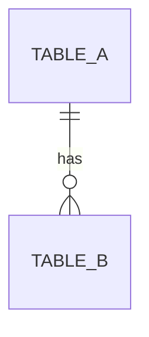

# Shared Artifacts Repository

This document defines the centralized artifact system shared across all skills. All skills MUST reference this document for artifact locations, naming conventions, and templates.

---

## Artifact Storage Structure

```
project-root/
├── docs/
│   └── features/
│       └── [feature-name]/         # One folder per feature (e.g. auth, payment)
│           └── [version]/          # Version of that feature (e.g. v1, v2)
│               ├── requirements/           # Business Analysis outputs
│               │   ├── user-stories.md     # US-xxx definitions
│               │   ├── functional-requirements.md    # FR-xxx specifications
│               │   ├── non-functional-requirements.md # NFR-xxx specifications
│               │   └── field-specifications.md       # Input/Output field specs
│               │
│               ├── test-design/            # Software Tester Design outputs
│               │   ├── sut-definition.md   # System Under Test
│               │   ├── test-scenarios.md   # SC-xxx definitions
│               │   ├── test-cases.md       # TC-xxx specifications
│               │   └── test-data.md        # Test data catalogue
│               │
│               ├── ux-design/              # UX/UI Design outputs
│               │   ├── user-personas.md    # User persona definitions
│               │   ├── user-journeys.md    # UJ-xxx user journey maps
│               │   ├── wireframes.md       # WF-xxx wireframe specs
│               │   ├── ui-specifications.md # UI-xxx component specs
│               │   └── design-system.md    # Design tokens and guidelines
│               │
│               ├── project/                # Project Management outputs
│               │   ├── backlog.md          # Epic and Story backlog
│               │   ├── iterations/         # Iteration cards
│               │   │   ├── iteration-1.md
│               │   │   └── iteration-N.md
│               │   ├── traceability-matrix.md  # US → FR → DEV → TC mapping
│               │   └── release-notes.md    # Release notes and changelog
│               │
│               ├── architecture/           # Software Architecture outputs (C4 Model)
│               │   ├── system-context.md   # C4 L1 — People + Software Systems
│               │   ├── containers.md       # C4 L2 — Apps, Services & Data Stores
│               │   ├── components.md       # C4 L3 — Internal Components per Container
│               │   ├── api-contracts.md    # C4 L4 — API endpoint specifications
│               │   ├── database-schema.md  # C4 L4 — DB tables, columns, indexes
│               │   ├── integration-contracts.md  # C4 L4 — External service contracts
│               │   ├── adrs/               # Architecture Decision Records
│               │   │   └── ADR-001-*.md
│               │   └── openapi/            # C4 L4 — OpenAPI specifications
│               │       └── [feature]-api.yaml
│               │
│               └── user-guide/             # Technical Writer outputs
│                   ├── getting-started.md
│                   ├── tutorials/
│                   ├── faq.md
│                   └── troubleshooting.md
│
└── tests/                      # Test implementation (AI Orchestrator)
    ├── unit/
    ├── integration/
    └── e2e/
```

---

## Artifact ID Conventions

| Artifact Type | ID Format | Example | Produced By |
|---------------|-----------|---------|-------------|
| User Story | `US-[FEATURE]-###` | US-AUTH-001 | business-analysis |
| Functional Requirement | `FR-[FEATURE]-###` | FR-AUTH-001 | business-analysis |
| Non-Functional Requirement | `NFR-[FEATURE]-###` | NFR-AUTH-001 | business-analysis |
| Test Scenario | `SC-[FEATURE]-###` | SC-AUTH-001 | software-tester-design |
| Test Case | `TC-[FEATURE]-###` | TC-AUTH-001 | software-tester-design |
| User Journey | `UJ-[FEATURE]-###` | UJ-AUTH-001 | ux-ui-design |
| Wireframe | `WF-[FEATURE]-###` | WF-AUTH-001 | ux-ui-design |
| UI Specification | `UI-[FEATURE]-###` | UI-AUTH-001 | ux-ui-design |
| Developer Task | `DEV-[FEATURE]-###` | DEV-AUTH-001 | project-management |
| Epic | `EPIC-[FEATURE]-###` | EPIC-AUTH-001 | project-management |
| Architecture Decision | `ADR-###` | ADR-001 | software-architecture |

**Feature codes** should be short, uppercase identifiers:
- AUTH = Authentication
- REG = Registration
- PAY = Payment
- DASH = Dashboard
- (define as needed per project)

---

## Artifact Templates

### US - User Story Template

```markdown
## US-[FEATURE]-### — [Story Title]

**As a** [role]
**I want** [capability]
**So that** [benefit]

### Acceptance Criteria
- [ ] AC-1: [criterion]
- [ ] AC-2: [criterion]

### Business Conditions
- BC-1: [condition]
- BC-2: [condition]

### Dependencies
- Depends on: [US-xxx, FR-xxx if any]

### Priority
[P1 / P2 / P3]
```

---

### FR - Functional Requirement Template

```markdown
## FR-[FEATURE]-### — [Requirement Title]

**Traces to:** US-[FEATURE]-###

### Description
[Observable behavior that the system MUST exhibit]

### Input
| Field | Type | Constraints | Required |
|-------|------|-------------|----------|
| field_name | string | max 100 chars | Yes |

### Output
| Field | Type | Description |
|-------|------|-------------|
| result | object | [description] |

### Business Rules
1. [Rule 1]
2. [Rule 2]

### Error Conditions
| Condition | Response |
|-----------|----------|
| Invalid input | 400 Bad Request |
```

---

### NFR - Non-Functional Requirement Template

```markdown
## NFR-[FEATURE]-### — [Requirement Title]

**Category:** [Performance | Security | Scalability | Usability | Reliability | Maintainability]

**Traces to:** US-[FEATURE]-###

### Requirement
[Measurable quality attribute]

### Acceptance Threshold
- [Metric]: [threshold value]
- Example: Response time < 200ms for 95th percentile

### Verification Method
[How this will be tested/measured]
```

---

### SC - Test Scenario Template

```markdown
## SC-[FEATURE]-### — [Scenario Title]

**Traces to:** US-[FEATURE]-###, FR-[FEATURE]-###

### Description
[High-level description of WHAT to test, not HOW]

### Preconditions
- [Precondition 1]
- [Precondition 2]

### Test Cases
| TC-ID | Summary | Priority |
|-------|---------|----------|
| TC-[FEATURE]-### | [brief summary] | P1 |

### Coverage
- Happy path: Yes/No
- Edge cases: [list]
- Error cases: [list]
```

---

### TC - Test Case Template

```markdown
## TC-[FEATURE]-### — [Test Case Title]

**Traces to:** SC-[FEATURE]-###, FR-[FEATURE]-###

### Test Attributes
| Attribute | Value |
|-----------|-------|
| Priority | P1 / P2 / P3 |
| Type | Unit / Integration / E2E |
| Technique | Equivalence Partitioning / Boundary Value / etc. |
| Automation | Automated / Manual |

### Preconditions
- [State or setup required before test]

### Test Data
| Variable | Value | Purpose |
|----------|-------|---------|
| input_1 | "value" | [why this value] |

### Steps
1. [Action 1]
2. [Action 2]
3. [Action 3]

### Expected Result
- [Expected outcome 1]
- [Expected outcome 2]

### Cleanup
- [Post-test cleanup if needed]
```

---

### UJ - User Journey Template

```markdown
## UJ-[FEATURE]-### — [Journey Title]

**Traces to:** US-[FEATURE]-###

### Persona
[Target user persona for this journey]

### Goal
[What the user is trying to accomplish]

### Journey Stages

| Stage | User Action | System Response | Emotion | Touchpoint |
|-------|-------------|-----------------|---------|------------|
| 1. Entry | [action] | [response] | [😊/😐/😟] | [screen/component] |
| 2. [Stage] | [action] | [response] | [emotion] | [touchpoint] |
| 3. Exit | [action] | [response] | [emotion] | [touchpoint] |

### Pain Points
- [Pain point 1]
- [Pain point 2]

### Opportunities
- [UX improvement opportunity 1]
- [UX improvement opportunity 2]
```

---

### WF - Wireframe Template

```markdown
## WF-[FEATURE]-### — [Screen/Component Name]

**Traces to:** UJ-[FEATURE]-###, US-[FEATURE]-###

### Screen Purpose
[What this screen/component accomplishes]

### Layout Structure
```
┌─────────────────────────────────┐
│           Header                │
├─────────────────────────────────┤
│                                 │
│        Main Content Area        │
│                                 │
├─────────────────────────────────┤
│           Footer                │
└─────────────────────────────────┘
```

### Elements

| Element | Type | Description | Interaction |
|---------|------|-------------|-------------|
| [element_name] | Button/Input/Card/etc. | [purpose] | [click/hover/etc.] |

### States
- Default: [description]
- Loading: [description]
- Error: [description]
- Empty: [description]
- Success: [description]

### Responsive Behavior
| Breakpoint | Layout Changes |
|------------|----------------|
| Desktop (>1024px) | [layout] |
| Tablet (768-1024px) | [layout] |
| Mobile (<768px) | [layout] |

### Navigation
- Entry points: [how users reach this screen]
- Exit points: [where users can go from here]
```

---

### UI - UI Specification Template

```markdown
## UI-[FEATURE]-### — [Component Name]

**Traces to:** WF-[FEATURE]-###, FR-[FEATURE]-###

### Component Type
[Atom / Molecule / Organism / Template / Page]

### Visual Specification

#### Dimensions
| Property | Value |
|----------|-------|
| Width | [value/auto/100%] |
| Height | [value/auto] |
| Padding | [top right bottom left] |
| Margin | [top right bottom left] |
| Border Radius | [value] |

#### Typography
| Element | Font | Size | Weight | Line Height | Color |
|---------|------|------|--------|-------------|-------|
| Title | [font] | [size] | [weight] | [height] | [token] |
| Body | [font] | [size] | [weight] | [height] | [token] |

#### Colors
| State | Background | Text | Border |
|-------|------------|------|--------|
| Default | [token] | [token] | [token] |
| Hover | [token] | [token] | [token] |
| Active | [token] | [token] | [token] |
| Disabled | [token] | [token] | [token] |

### Interaction States
| State | Visual Change | Trigger |
|-------|--------------|---------|
| Hover | [change] | Mouse over |
| Focus | [change] | Keyboard focus |
| Active | [change] | Click/tap |
| Disabled | [change] | disabled prop |

### Accessibility
- ARIA Role: [role]
- ARIA Label: [label pattern]
- Keyboard Navigation: [tab/enter/escape behavior]
- Focus Indicator: [description]
- Color Contrast: [WCAG level AA/AAA]

### Props/API (if component)
| Prop | Type | Default | Description |
|------|------|---------|-------------|
| [prop] | [type] | [default] | [description] |

### Usage Example
```jsx
<ComponentName prop="value" />
```
```

---

### Design System Template

```markdown
## Design System — [Project Name]

### Design Tokens

#### Colors
| Token Name | Value | Usage |
|------------|-------|-------|
| --color-primary | #[hex] | Primary actions, links |
| --color-secondary | #[hex] | Secondary actions |
| --color-background | #[hex] | Page backgrounds |
| --color-surface | #[hex] | Card/panel backgrounds |
| --color-text-primary | #[hex] | Main text |
| --color-text-secondary | #[hex] | Supporting text |
| --color-error | #[hex] | Error states |
| --color-success | #[hex] | Success states |
| --color-warning | #[hex] | Warning states |

#### Typography Scale
| Token | Size | Line Height | Usage |
|-------|------|-------------|-------|
| --text-xs | 12px | 16px | Captions |
| --text-sm | 14px | 20px | Small text |
| --text-base | 16px | 24px | Body text |
| --text-lg | 18px | 28px | Large body |
| --text-xl | 20px | 28px | Subheadings |
| --text-2xl | 24px | 32px | Headings |
| --text-3xl | 30px | 36px | Large headings |

#### Spacing Scale
| Token | Value | Usage |
|-------|-------|-------|
| --space-1 | 4px | Tight spacing |
| --space-2 | 8px | Default gap |
| --space-3 | 12px | Element padding |
| --space-4 | 16px | Section padding |
| --space-6 | 24px | Large gaps |
| --space-8 | 32px | Section margins |

#### Breakpoints
| Token | Value | Description |
|-------|-------|-------------|
| --breakpoint-sm | 640px | Mobile landscape |
| --breakpoint-md | 768px | Tablet |
| --breakpoint-lg | 1024px | Desktop |
| --breakpoint-xl | 1280px | Large desktop |

### Component Library Reference
| Component | Status | UI-ID |
|-----------|--------|-------|
| Button | Ready | UI-[F]-001 |
| Input | Ready | UI-[F]-002 |
| Card | In Progress | UI-[F]-003 |
```

---

### DEV - Developer Task Template

```markdown
## DEV-[FEATURE]-### — [Task Title]

**Traces to:** TC-[FEATURE]-###, FR-[FEATURE]-###

### Layer
[Database | API | Frontend | Integration | Infrastructure]

### Description
[What needs to be implemented]

### Definition of Done
- [ ] TC-[FEATURE]-### passes
- [ ] Code review approved
- [ ] Documentation updated

### Dependencies
- Blocked by: [DEV-xxx if any]
- Blocks: [DEV-xxx if any]

### Estimated Complexity
[S / M / L / XL]
```

---

### Test Data Catalogue Template

```markdown
## Test Data Catalogue — [Feature Name]

### Valid Data Sets

| ID | Description | Data |
|----|-------------|------|
| TD-VALID-001 | Standard valid input | `{ "field": "value" }` |
| TD-VALID-002 | Boundary minimum | `{ "field": "a" }` |

### Invalid Data Sets

| ID | Description | Data | Expected Error |
|----|-------------|------|----------------|
| TD-INVALID-001 | Empty required field | `{ "field": "" }` | 400 - Field required |
| TD-INVALID-002 | Exceeds max length | `{ "field": "a"*101 }` | 400 - Too long |

### Edge Case Data Sets

| ID | Description | Data | Expected Behavior |
|----|-------------|------|-------------------|
| TD-EDGE-001 | Unicode characters | `{ "field": "日本語" }` | Accepted |
```

---

### Database Schema Template

```markdown
## Database Schema — [Feature Name]

**Traces to:** FR-[FEATURE]-###, DEV-[FEATURE]-###

### Tables

#### [table_name]

| Column | Type | Constraints | Description |
|--------|------|-------------|-------------|
| id | UUID | PK | Primary key |
| created_at | TIMESTAMP | NOT NULL, DEFAULT NOW() | Creation timestamp |
| updated_at | TIMESTAMP | NOT NULL | Last update timestamp |
| [column] | [type] | [constraints] | [description] |

### Indexes

| Index Name | Table | Columns | Type |
|------------|-------|---------|------|
| idx_[name] | [table] | [columns] | BTREE / GIN / etc. |

### Relationships



### Migrations
- Migration file: `migrations/[timestamp]_[description].sql`
```

---

### API Contract Template

```markdown
## API Contract — [Feature Name]

**Traces to:** FR-[FEATURE]-###, TC-[FEATURE]-###

### Endpoint

| Method | Path | Description |
|--------|------|-------------|
| POST | /api/v1/[resource] | [description] |

### Request

**Headers**
| Header | Required | Description |
|--------|----------|-------------|
| Authorization | Yes | Bearer token |
| Content-Type | Yes | application/json |

**Body**
```json
{
  "field": "string (required, max 100 chars)"
}
```

### Response

**Success (200/201)**
```json
{
  "data": {
    "id": "uuid",
    "field": "string"
  }
}
```

**Error (4xx/5xx)**
```json
{
  "error": {
    "code": "ERROR_CODE",
    "message": "Human readable message"
  }
}
```

### Validation Rules
| Field | Rule | Error Code |
|-------|------|------------|
| field | Required, max 100 chars | INVALID_FIELD |
```

---

### Architecture Decision Record (ADR) Template

```markdown
# ADR-### — [Decision Title]

**Date:** YYYY-MM-DD
**Status:** Proposed | Accepted | Deprecated | Superseded

## Context
[What is the issue or decision that needs to be made?]

## Decision
[What was decided and why?]

## Consequences
### Positive
- [benefit 1]
- [benefit 2]

### Negative
- [trade-off 1]
- [trade-off 2]

## Alternatives Considered
1. [Alternative 1] — rejected because [reason]
2. [Alternative 2] — rejected because [reason]
```

---

## Traceability Matrix Template

```markdown
## Traceability Matrix — [Feature Name]

| User Story | Functional Req | Developer Task | Test Case | Status |
|------------|----------------|----------------|-----------|--------|
| US-[F]-001 | FR-[F]-001 | DEV-[F]-001 | TC-[F]-001 | Pending |
| US-[F]-001 | FR-[F]-002 | DEV-[F]-002 | TC-[F]-002 | In Progress |
| US-[F]-002 | FR-[F]-003 | DEV-[F]-003 | TC-[F]-003 | Complete |

### Coverage Summary
- Total User Stories: X
- Total Test Cases: Y
- Coverage: Z%
```

---

## Artifact Lifecycle

```
┌─────────────────┐
│ business-       │
│ analysis        │
│   CREATES:      │
│   - US-xxx      │
│   - FR-xxx      │
│   - NFR-xxx     │
└────────┬────────┘
         │ READS US/FR/NFR
         ├──────────────────────────┐
         ▼                          ▼
┌─────────────────┐      ┌─────────────────┐
│ software-tester │      │  ux-ui-design   │
│ -design         │      │   CREATES:      │
│   CREATES:      │      │   - UJ-xxx      │
│   - SC-xxx      │      │   - WF-xxx      │
│   - TC-xxx      │      │   - UI-xxx      │
│   - Test Data   │      │   - Design Sys  │
└────────┬────────┘      └────────┬────────┘
         │                        │
         │ READS SC/TC + UJ/UI    │
         └────────────┬───────────┘
                      ▼
         ┌─────────────────────┐
         │ software-arch       │
         │ (C4 Model)          │
         │   CREATES:          │
         │   L1: Sys Context   │
         │   L2: Containers    │
         │   L3: Components    │
         │   L4: API Contract  │
         │       DB Schema     │
         │       ADRs          │
         │       OpenAPI       │
         └──────────┬──────────┘
                    │ READS ALL ABOVE + C4 ARCH
                    ▼
         ┌─────────────────────┐
         │ project-mgmt        │
         │   CREATES:          │
         │   - DEV-xxx         │
         │   - Iterations      │
         │   - Backlogs        │
         │   - Traceability    │
         └──────────┬──────────┘
                    │ READS BACKLOG SC/TC + ARCH
                    ▼
         ┌─────────────────────┐
         │ ai-orchestrator     │
         │   CREATES:          │
         │   - Test Code       │
         │   - Impl Code       │
         │   - Migrations      │
         │   - Tech Docs       │
         └──────────┬──────────┘
                    │ READS SC/TC (on pass)
                    ▼
         ┌─────────────────────┐
         │ technical-writer    │
         │   CREATES:          │
         │   - User Docs       │
         │   - Tutorials       │
         │   - FAQ             │
         └─────────────────────┘
```

---

## How Skills Should Reference This Document

All skills MUST include this directive in their workflow:

```markdown
### Artifact Reference
All artifacts MUST be stored in locations defined in `.opencode/artifacts/ARTIFACTS.md`.
Use the templates and naming conventions specified there.
```

---

## Quick Reference Card

| When you need... | Look in... | C4 Level / Template |
|------------------|------------|---------------------|
| User requirements | `docs/features/[feature]/[version]/requirements/user-stories.md` | US Template |
| What system must do | `docs/features/[feature]/[version]/requirements/functional-requirements.md` | FR Template |
| Quality attributes | `docs/features/[feature]/[version]/requirements/non-functional-requirements.md` | NFR Template |
| What to test | `docs/features/[feature]/[version]/test-design/test-scenarios.md` | SC Template |
| How to test | `docs/features/[feature]/[version]/test-design/test-cases.md` | TC Template |
| Test inputs | `docs/features/[feature]/[version]/test-design/test-data.md` | Test Data Template |
| User journeys | `docs/features/[feature]/[version]/ux-design/user-journeys.md` | UJ Template |
| Wireframes | `docs/features/[feature]/[version]/ux-design/wireframes.md` | WF Template |
| UI components | `docs/features/[feature]/[version]/ux-design/ui-specifications.md` | UI Template |
| Design tokens | `docs/features/[feature]/[version]/ux-design/design-system.md` | Design System Template |
| Who uses the system + external systems | `docs/features/[feature]/[version]/architecture/system-context.md` | C4 L1 |
| Apps, services, data stores + tech choices | `docs/features/[feature]/[version]/architecture/containers.md` | C4 L2 |
| Internal structure per container | `docs/features/[feature]/[version]/architecture/components.md` | C4 L3 |
| API specs | `docs/features/[feature]/[version]/architecture/api-contracts.md` | C4 L4 / API Template |
| DB design | `docs/features/[feature]/[version]/architecture/database-schema.md` | C4 L4 / DB Template |
| Design decisions | `docs/features/[feature]/[version]/architecture/adrs/` | ADR Template |
| Task breakdown | `docs/features/[feature]/[version]/project/backlog.md` | DEV Template |
| Current sprint | `docs/features/[feature]/[version]/project/iterations/iteration-N.md` | Iteration Card |
| End-to-end tracing | `docs/features/[feature]/[version]/project/traceability-matrix.md` | Traceability Template |
