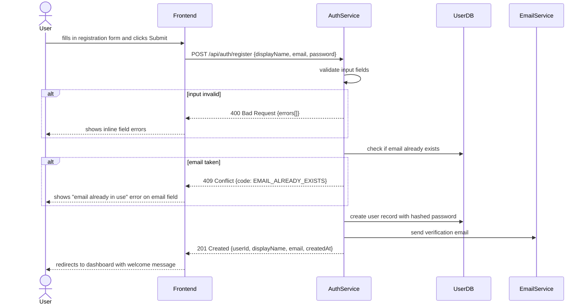
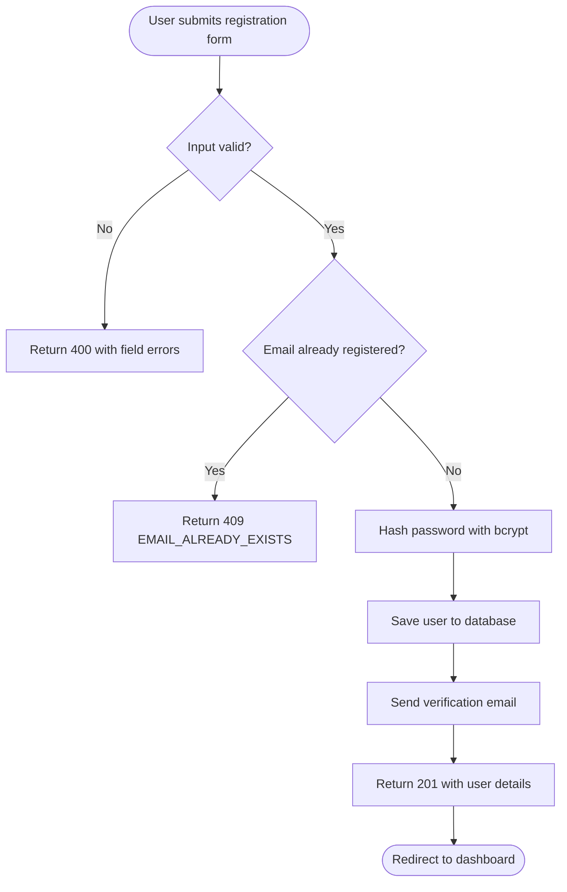
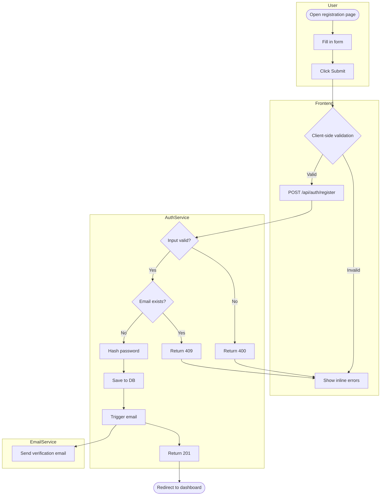

# Product Manager — Requirements Engineering Skill

## Role & Responsibility

This skill takes a **feature idea or stakeholder brief as input** and produces a **structured requirements document** ready for engineering and QA.

```
[pm]                                  →     [software-tester-design]
──────────────────────────                  ──────────────────────────────
Step 1: Elicit requirements                 Receives: FR list, User Story Map,
Step 2: Build User Story Map                         Input/Output specs, NFRs
Step 3: Draw Swimlane (Mermaid)             Uses them to design test scenarios
Step 4: Specify Input/Output fields         and produce TC-xxx test cases
Step 5: Write FR and NFR
```

---

## Step 1 — Requirement Elicitation

Before writing anything, ask questions to surface what is known and what is missing. Use the following checklist as a guide — not every question applies to every feature.

### Elicitation Checklist

**Business context**
- What problem does this feature solve? For whom?
- What is the trigger that starts this process? (user action, event, scheduled job, external call)
- What does success look like for the business?

**Actors**
- Who interacts with this feature? (end user, admin, system, 3rd-party service)
- What role/permission does each actor need?

**Happy path**
- Walk me through the step-by-step flow when everything goes right.
- What does the user/system do first? Then what?

**Business conditions and rules**
- Are there conditions that must be true before this step can proceed?
- Are there limits, thresholds, or allowlists? (e.g. max attempts, approved domains, value ranges)
- Are there any time constraints? (expiry, scheduling, deadlines)

**Alternate and exception paths**
- What happens if the user provides invalid data?
- What happens if a downstream service is unavailable?
- Can this action be retried? Reversed? Cancelled?

**Data**
- What data does the system receive as input? From where?
- What data does the system produce as output? To where?
- What data is persisted? For how long?

**Integration**
- Does this feature call any external APIs or services?
- Does it publish or consume events from a queue/broker?

**Non-functional**
- Are there response time expectations?
- Are there volume or concurrency expectations?
- Are there compliance or security requirements? (PII, encryption, audit logs)

---

## Step 2 — User Story Map

A User Story Map organises stories by **Activities → Tasks → Stories** and makes the business flow and scope visible at a glance.

### Structure

```
ACTIVITY        (high-level thing the user wants to accomplish)
  └── TASK      (step the user takes within the activity)
        └── USER STORY   (specific need: "As a [role] I want to [action] so that [benefit]")
              └── ACCEPTANCE CRITERIA  (conditions that must be true for the story to be done)
```

### Output Format

```
## User Story Map — [Feature Name]

### Activity: [Name]
#### Task: [Name]

US-[FEATURE]-[SEQ]: As a [role], I want to [action], so that [benefit].

Acceptance Criteria:
  AC-1: Given [context], when [action], then [observable outcome].
  AC-2: Given [context], when [action], then [observable outcome].

Business Conditions:
  BC-1: [Rule that governs this story — constraint, limit, allowlist, etc.]
  BC-2: ...

Priority: Must Have | Should Have | Could Have | Won't Have (MoSCoW)
```

### Example — User Registration Feature

```
## User Story Map — User Registration

### Activity: Create an Account

#### Task: Fill in Registration Form

US-REG-001: As a new visitor, I want to register with my email and password,
            so that I can access the platform.

Acceptance Criteria:
  AC-1: Given I submit a valid display name, email, and password,
        when the system processes the request,
        then my account is created and I am redirected to the dashboard.
  AC-2: Given I submit an email that is already registered,
        when the system checks for duplicates,
        then I see an inline error and my account is not created.
  AC-3: Given I submit a password that does not meet the policy,
        when the system validates the input,
        then I see a specific error message describing the policy requirement.

Business Conditions:
  BC-1: Display name must be 3–30 characters, no spaces, alphanumeric only.
  BC-2: Email domain must be on the approved whitelist.
  BC-3: Password must be at least 8 characters, contain one uppercase letter,
        one number, and one special character.
  BC-4: A verification email must be sent within 60 seconds of successful registration.

Priority: Must Have

---

#### Task: Verify Email Address

US-REG-002: As a newly registered user, I want to verify my email address,
            so that the platform can confirm I own the account.

Acceptance Criteria:
  AC-1: Given I click the verification link in my email,
        when the token is valid and not expired,
        then my account is marked as verified and I can log in.
  AC-2: Given the verification link has expired,
        when I click it,
        then I see a message and an option to resend the verification email.

Business Conditions:
  BC-1: Verification tokens expire after 24 hours.
  BC-2: A user may request a maximum of 3 resend attempts per hour.

Priority: Must Have
```

---

## Step 3 — Swimlane Diagram (Mermaid)

Draw a swimlane diagram to show **who does what and when** across all actors. Use Mermaid `sequenceDiagram` for step-by-step flows or `flowchart` for decision-heavy flows.

### When to use each

| Diagram type        | Use when                                                          |
| ------------------- | ----------------------------------------------------------------- |
| `sequenceDiagram`   | The flow is primarily sequential — request/response between actors |
| `flowchart LR/TD`   | The flow has many branches, decisions, or loops                   |

### Sequence Diagram Template



### Flowchart Template (decision-heavy)



### Swimlane Flowchart (multiple actors, clear lane separation)



---

## Step 4 — Input / Output Field Specification

For every action in the system, specify all input and output fields precisely. This is the contract between PM, Engineering, and QA.

### Input Field Table

| Field         | Type     | Required | Format / Constraints                                   | Example            |
| ------------- | -------- | -------- | ------------------------------------------------------ | ------------------ |
| `displayName` | `string` | Yes      | 3–30 chars, alphanumeric, no spaces                    | `alice123`         |
| `email`       | `string` | Yes      | Valid email format, domain on approved whitelist        | `alice@gmail.com`  |
| `password`    | `string` | Yes      | 8–64 chars, ≥1 uppercase, ≥1 digit, ≥1 special char   | `ValidPass1!`      |

### Output Field Table (Success Response)

| Field         | Type       | Always present | Format                    | Example                                |
| ------------- | ---------- | -------------- | ------------------------- | -------------------------------------- |
| `userId`      | `string`   | Yes            | UUID v4                   | `a1b2c3d4-...`                         |
| `displayName` | `string`   | Yes            | As provided               | `alice123`                             |
| `email`       | `string`   | Yes            | Lowercase                 | `alice@gmail.com`                      |
| `createdAt`   | `string`   | Yes            | ISO 8601 UTC              | `2025-01-15T10:30:00Z`                 |
| `password`    | —          | Never          | Must NOT appear in response | —                                    |

### Error Response Format

```json
{
  "code": "VALIDATION_ERROR",
  "message": "One or more fields are invalid.",
  "errors": [
    {
      "field": "displayName",
      "code": "MIN_LENGTH",
      "message": "Display name must be at least 3 characters."
    }
  ]
}
```

### Error Code Registry

| HTTP Status | Code                   | When                                              |
| ----------- | ---------------------- | ------------------------------------------------- |
| 400         | `VALIDATION_ERROR`     | One or more input fields fail validation          |
| 400         | `MIN_LENGTH`           | Field value is shorter than the minimum           |
| 400         | `MAX_LENGTH`           | Field value exceeds the maximum                   |
| 400         | `INVALID_FORMAT`       | Field value does not match the required pattern   |
| 400         | `DOMAIN_NOT_ALLOWED`   | Email domain is not on the approved whitelist     |
| 409         | `EMAIL_ALREADY_EXISTS` | An account with this email already exists         |
| 500         | `INTERNAL_ERROR`       | Unexpected server error                           |

---

## Step 5 — Functional Requirements (FR)

Write one FR per observable behaviour. Each FR must be testable — if you cannot write a test for it, it is not specific enough.

### Format

```
FR-[FEATURE]-[SEQ]: [The system shall / must] [observable behaviour] [under what condition].
```

### Example — User Registration

```
FR-REG-001: The system shall accept a registration request and create a user account
            when displayName, email, and password all pass validation.

FR-REG-002: The system shall reject a registration request with HTTP 400 and a field-level
            error when any required input field fails validation.

FR-REG-003: The system shall reject a registration request with HTTP 409 and error code
            EMAIL_ALREADY_EXISTS when the submitted email address is already registered.

FR-REG-004: The system shall store the user's password as a bcrypt hash and must never
            store or return the plaintext password.

FR-REG-005: The system shall send a verification email to the registered address within
            60 seconds of successful account creation.

FR-REG-006: The system shall not expose the password field in any API response,
            log entry, or error message.

FR-REG-007: The system shall enforce a maximum of 3 verification email resend requests
            per email address per hour.

FR-REG-008: The system shall invalidate verification tokens after 24 hours.
```

---

## Step 6 — Non-Functional Requirements (NFR)

NFRs define the quality attributes of the system. Group by category.

### Format

```
NFR-[CATEGORY]-[SEQ]: [The system shall] [measurable quality attribute].
```

### NFR Categories and Examples

#### Performance

```
NFR-PERF-001: The registration API endpoint shall respond within 500ms at the 95th percentile
              under a load of 100 concurrent requests.

NFR-PERF-002: The verification email shall be delivered to the user's inbox within 60 seconds
              of account creation under normal operating conditions.
```

#### Security

```
NFR-SEC-001: Passwords shall be hashed using bcrypt with a minimum cost factor of 12
             before being stored in the database.

NFR-SEC-002: Verification tokens shall be cryptographically random and at least 32 bytes
             in length.

NFR-SEC-003: All API endpoints shall enforce HTTPS. Requests over HTTP shall be rejected
             with HTTP 301.

NFR-SEC-004: The system shall rate-limit registration attempts to a maximum of 10 requests
             per IP address per minute.
```

#### Reliability

```
NFR-REL-001: The registration service shall have an availability of at least 99.9% per month.

NFR-REL-002: If the email service is unavailable, the user account shall still be created
             and the email delivery shall be retried up to 3 times with exponential backoff.
```

#### Scalability

```
NFR-SCALE-001: The registration service shall support at least 500 registrations per minute
               without degradation in response time.
```

#### Compliance and Auditability

```
NFR-COMP-001: The system shall log every registration attempt (success and failure) including
              timestamp, IP address, and outcome — without logging the password or token.

NFR-COMP-002: User personal data (email, display name) shall be stored in compliance with
              GDPR Article 5 — purpose limitation and data minimisation principles.
```

#### Maintainability

```
NFR-MAINT-001: The approved email domain whitelist shall be configurable via environment
               variable without requiring a code deployment.
```

---

## Output Document Template

Use this structure to produce the final requirements document for a feature:

```markdown
# Requirements — [Feature Name]

## 1. Overview
[2–3 sentences: what this feature does, who it is for, and why it is being built]

## 2. Actors
| Actor          | Description                          |
| -------------- | ------------------------------------ |
| [Role]         | [What they do in this feature]       |

## 3. User Story Map
[US-xxx stories with AC and BC — from Step 2]

## 4. Business Flow — Swimlane
[Mermaid diagram — from Step 3]

## 5. Input / Output Field Specification
[Input and output tables per action — from Step 4]
[Error code registry]

## 6. Functional Requirements
[FR-xxx list — from Step 5]

## 7. Non-Functional Requirements
[NFR-xxx list grouped by category — from Step 6]

## 8. Open Questions
| # | Question                              | Owner    | Due     | Status |
|---|---------------------------------------|----------|---------|--------|
| 1 | [Unresolved question from elicitation]| [Person] | [Date]  | Open   |

## 9. Out of Scope
- [Things explicitly not included in this feature]
```

---

## Traceability

Every item produced by this skill has an ID that traces through to QA:

```
US-REG-001  →  FR-REG-001, FR-REG-002  →  TC-REG-001 (software-tester-design)
                                        →  TC-REG-002
US-REG-002  →  FR-REG-003              →  TC-REG-003
```

Always record this traceability in the requirements document so that test coverage gaps are visible.
