# AI Agent Workflow

This document describes the complete AI agent workflow for agentic software development. The workflow implements **Shift-Left Testing**, **TDD (Red-Green-Refactor)**, **Just-Enough Architecture**, and **Human-in-the-Loop** principles.

---

## Workflow Overview

```mermaid
flowchart LR
    UR_BA["User Review (UR-BA)"]
    UR_SWT["User Review (UR-SWT)"]
    UR_UX["User Review (UR-UX)"]
    UR_ARCH["User Review (UR-ARCH)"]
    UR_PM["User Review (UR-PM)"]
    UR_DOC["User Review (UR-DOC)"]
    UR_UAT["User Review (UR-UAT)"]

    START(["Start"])

    %% Phase 1 — Product Discovery
    subgraph PD["Product Discovery"]
      BA["Requirement Gathering (BA)"]
      USER_APPROVED{{"is Approve?"}}
      subgraph DESIGN_PARALLEL["Design Phase (parallel)"]
          SWT["Test Design (SWT)"]
          UX["UX/UI Design"]
      end
      BA -- Need User Review --> UR_BA
      UR_BA --> USER_APPROVED
      USER_APPROVED -- "User needs to adjust" --> BA
      USER_APPROVED -- "Approved" --> DESIGN_PARALLEL
    end

    %% Phase 2 — System Design
    subgraph ARCH["System Design (per scenario) — C4 Model"]
      C4CTX["System Context Diagram\n(C4 L1 — People + Software Systems)"]
      C4CONT["Container Diagram\n(C4 L2 — Apps, Services & Data Stores)"]
      C4COMP["Component Diagram\n(C4 L3 — Internal Components per Container)"]
      C4CODE["Code Diagram\n(C4 L4 — API Contract + DB Schema + OpenAPI Spec)"]
      C4CTX --> C4CONT --> C4COMP --> C4CODE
    end

    %% Phase 3 — Iteration Planning
    subgraph PRM["Project Management (Backlogs)"]
      PM["Breakdown Scenarios into Iterations (PM)"]
      PMBACKL["Project Backlogs"]
      PM --> UR_PM
      USER_PM_APPROVED{{"is Approve?"}}
      UR_PM -- Need User Review --> USER_PM_APPROVED
      USER_PM_APPROVED -- "User needs to adjust" --> PM
      USER_PM_APPROVED -- "Approved" --> PMBACKL
    end

    %% Phase 4 — Iteration Execution
    subgraph ITERATION["Iteration — one scenario at a time"]
      ORC["AI Orchestrator (receives SC-xxx + TC-xxx)"]
      PICKUP["Pickup task from Backlogs"]
      subgraph DEVLOOP["Development Loop"]
        TDD["Write Failing Test (TDD Red)"]
        IMPL["Implement (TDD Green)"]
        IMPLCHECK{{"Green attempts >= 5?"}}
        IMPLBLOCK["🚨 Blocked — Escalate to User"]
        REFAC["Refactor"]
        INT["Integrate"]
        TESTALL["Test All (automated suite)"]
        TECHDOC["Technical Docs (README, setup)"]
      end
    end

    UAT["UAT (PM + Software Tester)"]
    PASS{{"is Pass?"}}
    BUG["Fix Bug"]
    REQ["Revisit Requirement (BA / PM)"]

    %% Phase 5 — Documentation & Retrospective
    subgraph DOCS["Documentation"]
        USERDOC["User Documentation (technical-writer)"]
        ITERUPDATE["Iteration Update (PM adapts backlog + generates release notes)"]
        USERDOC --> UR_DOC
        UR_DOC --> ITERUPDATE
    end

    subgraph RETROS["Retrospective"]
        USERRETRO["User creates rules or conditions to improve next Iteration"]
    end

    %% Flow
    START --> BA

    SWT --> UR_SWT
    USER_SWT_APPROVED{{"is Approve?"}}
    UR_SWT -- Need User Review --> USER_SWT_APPROVED
    USER_SWT_APPROVED -- "User needs to adjust" --> UR_SWT
    USER_SWT_APPROVED -- "Approved" --> ARCH

    UX --> UR_UX
    USER_UX_APPROVED{{"is Approve?"}}
    UR_UX -- Need User Review --> USER_UX_APPROVED
    USER_UX_APPROVED -- "User needs to adjust" --> UR_UX
    USER_UX_APPROVED -- "Approved" --> ARCH

    C4CODE --> UR_ARCH
    USER_ARCH_APPROVED{{"is Approve?"}}
    UR_ARCH -- Need User Review --> USER_ARCH_APPROVED
    USER_ARCH_APPROVED -- "User needs to adjust" --> ARCH
    USER_ARCH_APPROVED -- "Approved" --> PM

    PMBACKL -- "Pickup to Develop" --> ORC
    ORC --> PICKUP --> TDD

    TDD --> IMPL --> IMPLCHECK
    IMPLCHECK -- "No" --> REFAC --> INT --> TESTALL --> TECHDOC
    IMPLCHECK -- "Yes" --> IMPLBLOCK
    IMPLBLOCK -- "Fixed Done" --> TESTALL

    TECHDOC --> UAT
    UAT --> UR_UAT
    UR_UAT --> PASS
    PASS -- "Yes next scenario" --> ORC
    PASS -- "No: have bug" --> BUG --> DEVLOOP
    PASS -- "No: wrong requirement" --> REQ --> PM

    ORC -- "iteration done (all scenarios pass)" --> USERDOC
    ITERUPDATE --> RETROS
    USERRETRO -- "next iteration" --> ORC
```



---

## Agent Roles & Responsibilities

### 1. Business Analysis (BA)

**Skill:** `business-analysis`

**Purpose:** Gather and structure requirements for features, systems, or products.

**Triggers:**

- requirements, user story, user story map
- business flow, business rules, business conditions
- acceptance criteria, functional requirement, NFR, FR
- "what does the system need to do", "gather requirements for"

**Workflow Steps:**

1. **Elicit requirements** — Ask stakeholder questions
2. **Build User Story Map** — Understand business flow and conditions
3. **Draw Swimlane** — Mermaid diagrams for actor interactions
4. **Specify Input/Output** — Field data types and formats
5. **Write FR and NFR** — Structured requirements document
6. **[User Review — UR-BA]** — Review requirements for completeness and accuracy

**Outputs:**
| Artifact | ID Format | Storage |
|----------|-----------|---------|
| User Stories | `US-[FEATURE]-###` | `docs/requirements/user-stories.md` |
| Functional Requirements | `FR-[FEATURE]-###` | `docs/requirements/functional-requirements.md` |
| Non-Functional Requirements | `NFR-[FEATURE]-###` | `docs/requirements/non-functional-requirements.md` |
| Field Specifications | — | `docs/requirements/field-specifications.md` |

**Feeds into:** `software-tester-design`, `ux-ui-designer`

---

### 2. Software Tester Design (SWT)

**Skill:** `software-tester-design`

**Purpose:** Design tests before writing any code (Shift-Left Testing).

**Triggers:**

- test design, test planning, test scenarios, test cases
- SUT, system under test, BDD, TDD
- "what should I test", "design tests for", "create test cases for"

**Workflow Steps:**

1. **Define SUT** — System Under Test definition
2. **Map Business Flow** — Understand process from requirements
3. **Specify Input/Output** — Per action field specs
4. **Design Test Scenarios** — High-level what to test
5. **Design Test Cases** — Apply techniques (EP, BVA, Decision Tables, State Transition, Pairwise, Error Guessing)
6. **Design Test Data** — Valid, invalid, edge case data sets
7. **[User Review — UR-SWT]** — Validate test coverage and quality

**Outputs:**
| Artifact | ID Format | Storage |
|----------|-----------|---------|
| SUT Definition | — | `docs/test-design/sut-definition.md` |
| Test Scenarios | `SC-[FEATURE]-###` | `docs/test-design/test-scenarios.md` |
| Test Cases | `TC-[FEATURE]-###` | `docs/test-design/test-cases.md` |
| Test Data | `TD-[TYPE]-###` | `docs/test-design/test-data.md` |

**Feeds into:** `software-architecture`

---

### 3. UX/UI Designer

**Skill:** `ux-ui-designer`

**Purpose:** Design user interfaces, components, and design systems.

**Triggers:**

- design system, UI components, UX flows, wireframes
- prototypes, accessibility, WCAG, ARIA
- color tokens, typography scale, responsive design
- "design/review/improve UI"

**Workflow Steps:**

1. **Read Design System Config** — Understand theme and framework
2. **Design User Journeys** — Map user flows (UJ-xxx)
3. **Create Wireframes** — Layout structure (WF-xxx)
4. **Specify UI Components** — Detailed specs (UI-xxx)
5. **Define Design System** — Tokens, colors, typography, spacing
6. **[User Review — UR-UX]** — Validate design against requirements

**Outputs:**
| Artifact | ID Format | Storage |
|----------|-----------|---------|
| User Personas | — | `docs/ux-design/user-personas.md` |
| User Journeys | `UJ-[FEATURE]-###` | `docs/ux-design/user-journeys.md` |
| Wireframes | `WF-[FEATURE]-###` | `docs/ux-design/wireframes.md` |
| UI Specifications | `UI-[FEATURE]-###` | `docs/ux-design/ui-specifications.md` |
| Design System | — | `docs/ux-design/design-system.md` |

**Feeds into:** `software-architecture`

---

### 4. Software Architecture (System Design)

**Skill:** `software-architecture`

**Purpose:** Design just-enough technical architecture per scenario using the C4 Model — no big upfront design.

**Triggers:**

- architecture, system design, C4 model
- API design, API contract, database design, schema, data model, ERD
- OpenAPI, Swagger
- "how should I structure the API", "what tables do I need"

**Workflow Steps — C4 Model drill-down:**

1. **C4 L1 — System Context Diagram** — Identify People (users, personas) and external Software Systems that interact with the system
2. **C4 L2 — Container Diagram** — Define apps, services, and data stores; document tech choices per container
3. **C4 L3 — Component Diagram** — Break down each container into its internal components and their responsibilities
4. **C4 L4 — Code Diagram** — Specify API contracts (endpoints, request/response, errors), DB schema (tables, indexes, constraints), and generate OpenAPI spec; record ADRs for trade-offs
5. **[User Review — UR-ARCH]** — Approve architecture before project planning begins

**Outputs:**
| Artifact | Level | Storage |
|----------|-------|---------|
| System Context Diagram | C4 L1 | `docs/architecture/system-context.md` |
| Container Diagram | C4 L2 | `docs/architecture/containers.md` |
| Component Diagram | C4 L3 | `docs/architecture/components.md` |
| API Contracts | C4 L4 | `docs/architecture/api-contracts.md` |
| Database Schema | C4 L4 | `docs/architecture/database-schema.md` |
| Integration Contracts | C4 L4 | `docs/architecture/integration-contracts.md` |
| ADRs | C4 L4 | `docs/architecture/adrs/ADR-###-*.md` |
| OpenAPI Specs | C4 L4 | `docs/architecture/openapi/[feature]-api.yaml` |

**Feeds into:** `project-management`

---

### 5. Project Management (PM)

**Skill:** `project-management`

**Purpose:** Plan and coordinate delivery by consolidating all discovery + architecture artifacts into a structured backlog.

**Triggers:**

- project plan, sprint plan, iteration plan
- task breakdown, developer tasks, backlog, epic
- agile, iterative, incremental, sprint
- "break this into tasks", "plan the sprint for"

**Workflow Steps:**

1. **Ingest & Validate** — Consume US, FR, NFR, SC, TC, UJ, WF, UI, Architecture
2. **Build Epic → Story Backlog** — Group related items
3. **Break Down DEV Tasks** — Per layer (API, DB, Frontend, Infra)
4. **Map Dependencies** — Blocked by / Blocks
5. **Slice into Iterations** — Assign SC + TC per iteration as Definition of Done
6. **Produce Traceability Matrix** — End-to-end mapping
7. **[User Review — UR-PM]** — Approve iteration plan and task breakdown
8. **Publish Backlogs** — Ready for ORC to pick up
9. **Generate Release Notes** — At iteration retrospect (Iteration Update)

**Outputs:**
| Artifact | ID Format | Storage |
|----------|-----------|---------|
| Backlog | `EPIC-[FEATURE]-###` | `docs/project/backlog.md` |
| Developer Tasks | `DEV-[FEATURE]-###` | `docs/project/backlog.md` |
| Iteration Cards | — | `docs/project/iterations/iteration-N.md` |
| Traceability Matrix | — | `docs/project/traceability-matrix.md` |
| Release Notes | — | `docs/project/release-notes.md` |

**Feeds into:** `ai-orchestrator` (via Project Backlogs)

---

### 6. AI Orchestrator

**Skill:** `ai-orchestrator`

**Purpose:** Drive the TDD development loop for a single scenario autonomously.

**Triggers:**

- implement scenario, TDD, test-driven development
- red-green-refactor, write the test first
- implement SC-xxx, "make TC-xxx pass"
- "start the dev loop", "orchestrate development"

**Workflow Steps:**

1. **Pick up task from Backlogs** — Select next SC-xxx from Project Backlogs
2. **Load Scenario Context** — SC + TC + Architecture (C4 L4 artifacts)
3. **Write Failing Test (TDD Red)** — Test must fail first
4. **Implement Minimum Code (TDD Green)** — Just enough to pass
   - Track consecutive failed Green attempts
   - **If 5 or more consecutive Green attempts all fail → stop, escalate to user with a summary of what was tried and why it is stuck**
5. **Refactor** — Clean up without changing behavior
6. **Integrate** — Ensure changes work with existing code
7. **Run Full Test Suite** — All tests must pass
8. **Generate Technical Documentation** — README, JSDoc, inline comments

**The Red-Green-Refactor Cycle:**

```
   RED          GREEN           REFACTOR
   ───          ─────           ────────
   Write a      Write the       Clean up
   failing      minimum code    the code
   test         to make it      without
                pass            changing
                                behavior

   ↓            ↓               ↓
   Test FAILS   Test PASSES     Test STILL PASSES

   ─────────────────────────────────────────────
                     REPEAT

   ⚠️  GREEN ESCALATION RULE
   ──────────────────────────
   If the test still FAILS after ~5 consecutive
   implementation attempts:
     → STOP retrying
     → Compile a summary:
         • What was tried (approaches, changes)
         • Why each attempt failed
         • What is blocking progress
     → Escalate to User for guidance
     → Resume only after user unblocks
```

**Outputs:**
| Artifact | Storage |
|----------|---------|
| Test Files | `tests/unit/`, `tests/integration/`, `tests/e2e/` |
| Implementation Code | `src/` |
| Database Migrations | `migrations/` |
| Technical Docs | `README.md`, inline docs |

**Feeds into:** `UAT`

---

### 7. Software Tester Automation

**Skill:** `software-tester-automation`

**Purpose:** Translate test case designs (TC-xxx) into runnable automated test scripts.

**Triggers:**

- automate test, write test code
- test automation, create test script
- implement TC-xxx

**Workflow:**

- Receives TC-xxx from `software-tester-design`
- Translates into runnable scripts per test level (Unit, API, Component, E2E)
- Uses appropriate test frameworks (Jest, Vitest, Playwright, etc.)

---

### 8. Software Engineer

**Skill:** `software-engineer`

**Purpose:** General coding, debugging, code review, and implementation assistance.

**Triggers:**

- implement, code, debug, fix bug
- code review, refactor
- general programming questions

---

### 9. Technical Writer

**Skill:** `technical-writer`

**Purpose:** Generate user-facing documentation after all scenarios in an iteration pass UAT.

**Triggers:**

- user documentation, user guide, help docs
- tutorial, onboarding, FAQ, troubleshooting
- "write documentation for users", "create a user guide"

**Workflow Steps:**

1. **Understand Feature** — From user perspective
2. **Identify Documentation Needs** — What users need to know
3. **Write User Guide** — Step-by-step instructions
4. **Create Tutorials** — How-to guides
5. **Write FAQ** — Common questions
6. **Create In-App Help** — Contextual help text
7. **[User Review — UR-DOC]** — Validate documentation quality and accuracy

**Outputs:**
| Artifact | Storage |
|----------|---------|
| Getting Started | `docs/user-guide/getting-started.md` |
| Tutorials | `docs/user-guide/tutorials/` |
| FAQ | `docs/user-guide/faq.md` |
| Troubleshooting | `docs/user-guide/troubleshooting.md` |

**Runs AFTER:** All scenarios in the iteration pass UAT

---

## Complete Workflow Sequence

```
Phase 1: Product Discovery
─────────────────────────
┌─────────────────────────────────────────────────────────────────┐
│ 1. business-analysis                                            │
│    • Elicit requirements from stakeholders                      │
│    • Produce US-xxx, FR-xxx, NFR-xxx                           │
│    • Define input/output field specifications                   │
└─────────────────────────┬───────────────────────────────────────┘
                          │
                          ▼ UR-BA (User Review)
        ┌─────────────────┴─────────────────┐
        │                                   │ (parallel)
        ▼                                   ▼
┌──────────────────┐              ┌──────────────────┐
│ 2. software-     │              │ 3. ux-ui-        │
│    tester-design │              │    designer      │
│    (SWT)         │              │    (UX)          │
│                  │              │                  │
│ • Define SUT     │              │ • User journeys  │
│ • SC-xxx         │              │ • Wireframes     │
│ • TC-xxx         │              │ • UI specs       │
│ • Test data      │              │ • Design system  │
└────────┬─────────┘              └────────┬─────────┘
         │                                 │
         ▼ UR-SWT                         ▼ UR-UX
         └────────────┬────────────────────┘
                      │ (both feed into System Design)
                      ▼
Phase 2: System Design (per scenario) — C4 Model
─────────────────────────────────────────────────
┌─────────────────────────────────────────────────────────────────┐
│ 4. software-architecture                                        │
│                                                                 │
│    C4 L1 → System Context  (People + Software Systems)         │
│         ↓                                                       │
│    C4 L2 → Container       (Apps, Services, Data Stores)       │
│         ↓                                                       │
│    C4 L3 → Component       (Internal structure per container)  │
│         ↓                                                       │
│    C4 L4 → Code            (API Contract + DB Schema + OpenAPI)│
└─────────────────────────┬───────────────────────────────────────┘
                          │
                          ▼ UR-ARCH (User Review)
                          │
Phase 3: Iteration Planning
──────────────────────────
┌─────────────────────────────────────────────────────────────────┐
│ 5. project-management                                           │
│    • Ingest all artifacts (US, FR, NFR, SC, TC, UJ, WF, ARCH) │
│    • Build Epic → Story backlog                                 │
│    • Break down DEV-xxx tasks per layer                         │
│    • Slice into iterations with SC + TC as Definition of Done   │
│    • Produce traceability matrix                                │
│    • Publish Project Backlogs                                   │
└─────────────────────────┬───────────────────────────────────────┘
                          │
                          ▼ UR-PM (User Review)
                          │
Phase 4: Iteration Execution (repeat per scenario)
──────────────────────────────────────────────────
┌─────────────────────────────────────────────────────────────────┐
│ 6. ai-orchestrator (picks up SC-xxx from Project Backlogs)      │
│                                                                 │
│    ┌─────────────────────────────────────────────────────────┐  │
│    │  For each TC-xxx:                                       │  │
│    │    RED      → Write failing test                        │  │
│    │    GREEN    → Implement minimum code                    │  │
│    │    REFACTOR → Clean up without changing behavior        │  │
│    │    REPEAT                                               │  │
│    │                                                         │  │
│    │  ⚠️  If Green fails 5+ times → Escalate to User        │  │
│    └─────────────────────────────────────────────────────────┘  │
│                                                                 │
│    • Run full test suite                                        │
│    • Generate technical documentation                           │
└─────────────────────────┬───────────────────────────────────────┘
                          │
Phase 5: Review & UAT
─────────────────────
┌─────────────────────────────────────────────────────────────────┐
│    UAT (PM + Software Tester)                                   │
│    • Automated suite verification                               │
│    • Manual scenario walkthrough                                │
│    • Stakeholder acceptance                                     │
└─────────────────────────┬───────────────────────────────────────┘
                          │
                          ▼ UR-UAT (User Review)
                         │
          ┌──────────────┼──────────────┐
          │              │              │
          ▼              ▼              ▼
       ┌─────┐      ┌──────┐      ┌──────────┐
       │ Bug │      │ Req  │      │   Pass   │
       │ Fix │      │Wrong │      │          │
       └──┬──┘      └──┬───┘      └────┬─────┘
          │            │               │
          ▼            ▼               ▼
      DEVLOOP         PM        Next scenario → ORC
                               (or all done → Phase 6)

Phase 6: Documentation & Retrospective
───────────────────────────────────────
┌─────────────────────────────────────────────────────────────────┐
│ 7. technical-writer (all scenarios in iteration pass)          │
│    • Write user guides                                          │
│    • Create tutorials                                           │
│    • Write FAQ and troubleshooting                              │
└─────────────────────────┬───────────────────────────────────────┘
                          │
                          ▼ UR-DOC (User Review)
                          │
┌─────────────────────────────────────────────────────────────────┐
│    project-management — Iteration Update                        │
│    • Generate release notes                                     │
│    • Adapt backlog for next iteration                           │
└─────────────────────────┬───────────────────────────────────────┘
                          │
┌─────────────────────────────────────────────────────────────────┐
│    Retrospective                                                │
│    • User creates rules / conditions to improve next iteration  │
└─────────────────────────┬───────────────────────────────────────┘
                          │
                          ▼ next iteration → ORC
```

---

## Artifact Flow Summary

```
business-analysis     software-tester-design    ux-ui-designer
─────────────────     ──────────────────────    ──────────────
US-xxx ────────────┐  SC-xxx ────────────┐     UJ-xxx ─────┐
FR-xxx ────────────┤  TC-xxx ────────────┤     WF-xxx ─────┤
NFR-xxx ───────────┤  Test Data ─────────┤     UI-xxx ─────┤
Field Specs ───────┘                     │     Design Sys ─┘
           │                              │         │
           │ UR-BA                        │         │
           ▼                              ▼         │
           └──────────┬───────────────────┘         │
                      │                             │
                      ▼ UR-SWT           ▼ UR-UX ──┘
                      └──────────┬───────┘
                                 │ (both feed into System Design)
                                 ▼
                    software-architecture (C4 Model)
                    ──────────────────────────────────
                    C4 L1: System Context Diagram
                    C4 L2: Container Diagram
                    C4 L3: Component Diagram
                    C4 L4: API Contract + DB Schema ──┐
                           ADRs + OpenAPI Spec        │
                                                      │
                                                      ▼ UR-ARCH
                                         project-management
                                         ──────────────────
                                         EPIC-xxx
                                         DEV-xxx
                                         Iterations (Project Backlogs)
                                         Traceability ────────────────┐
                                                                      │
                                                                      ▼ UR-PM
                                                           ai-orchestrator
                                                           ───────────────
                                                           Test Code
                                                           Implementation
                                                           Migrations
                                                           Tech Docs ──────┐
                                                                           │
                                                           ┌───────────────┘
                                                           │
                                                           ▼
                                                    UAT → UR-UAT
                                                           │
                                                           ▼ (on pass)
                                                   technical-writer
                                                   ────────────────
                                                   User Guides
                                                   Tutorials
                                                   FAQ
                                                         │ UR-DOC
                                                         ▼
                                              Iteration Update + Retrospective
```

---

## Quick Reference

| Phase         | Agent                     | Input                             | Output                                                                         | User Review |
| ------------- | ------------------------- | --------------------------------- | ------------------------------------------------------------------------------ | ----------- |
| Discovery     | business-analysis         | Stakeholder brief                 | US, FR, NFR                                                                    | ✓ UR-BA     |
| Discovery     | software-tester-design    | US, FR, NFR                       | SC, TC, Test Data                                                              | ✓ UR-SWT    |
| Discovery     | ux-ui-designer            | US, FR, NFR                       | UJ, WF, UI, Design System                                                      | ✓ UR-UX     |
| System Design | software-architecture     | SC, TC, UJ, UI                    | C4 L1–L4: Context, Container, Component, API Contract, DB Schema, ADR, OpenAPI | ✓ UR-ARCH   |
| Planning      | project-management        | All above                         | EPIC, DEV, Iterations, Traceability, Backlogs                                  | ✓ UR-PM     |
| Development   | ai-orchestrator           | SC-xxx from Backlogs + C4 L4 Arch | Test Code, Impl Code, Tech Docs                                                | —           |
| Review        | UAT                       | Implementation                    | Approved / Rejected                                                            | ✓ UR-UAT    |
| Documentation | technical-writer          | Approved Iteration                | User Docs                                                                      | ✓ UR-DOC    |
| Retrospective | project-management + User | Iteration Results                 | Release Notes, Improved Rules                                                  | —           |

---

## Invoking Agents

Each agent is invoked via the skill system:

```
skill: business-analysis      → Gather requirements
skill: software-tester-design → Design test cases
skill: ux-ui-designer         → Design UI/UX
skill: project-management     → Plan iterations
skill: software-architecture  → Design API/DB
skill: ai-orchestrator        → Run TDD development loop
skill: software-engineer      → General coding assistance
skill: technical-writer       → Write user documentation
```

---

## Key Principles

### 1. Shift-Left Testing

- Design tests **before** implementation
- Test thinking starts at requirements phase
- TC-xxx defines Definition of Done

### 2. TDD (Test-Driven Development)

- RED: Write failing test first
- GREEN: Write minimum code to pass
- REFACTOR: Clean up without changing behavior
- Never write implementation without a failing test
- **Green Escalation:** If the test still fails after ~5 consecutive implementation attempts, stop and escalate to the user with a full summary of what was tried and what is blocking — do not keep retrying indefinitely

### 3. Just-Enough Architecture — C4 Model

- Design only what the current scenario needs — no big upfront design
- Follow the C4 Model drill-down: L1 Context → L2 Container → L3 Component → L4 Code
- Architecture is produced **before** project planning, so PM can scope tasks against a concrete design
- Architecture evolves with each scenario

### 4. Human-in-the-Loop

- Human review is a **hard gate**
- AI orchestrator signals ready, does not approve
- No merge without human approval

### 5. Traceability

- Every artifact traces to its source
- US → FR → SC → TC → DEV → Code
- End-to-end visibility via traceability matrix

---

## User Review Gates

User review is a **mandatory gate** at each phase transition. No phase may proceed without approval.

### User Review Sign-off

| Field                  | Description                                         |
| ---------------------- | --------------------------------------------------- |
| **ID**                 | `UR-[PHASE]-###` (e.g., `UR-BA-001`, `UR-ARCH-001`) |
| **Phase**              | BA, SWT, UX, ARCH, PM, UAT, DOC                     |
| **Reviewer**           | User / stakeholder name                             |
| **Date**               | Review completion date                              |
| **Status**             | Approved / Rejected / Changes Requested             |
| **Feedback**           | Comments and requested changes                      |
| **Artifacts Reviewed** | Links to reviewed artifacts                         |

### Review Checkpoints

| Gate    | Phase               | Criteria                                                              |
| ------- | ------------------- | --------------------------------------------------------------------- |
| UR-BA   | Product Discovery   | Requirements complete, clear, testable                                |
| UR-SWT  | Test Design         | Test scenarios cover all requirements and edge cases                  |
| UR-UX   | UX/UI Design        | Designs meet accessibility and usability standards                    |
| UR-ARCH | System Design       | C4 diagrams accurate; API contract + DB schema sound; ADRs documented |
| UR-PM   | Iteration Planning  | Backlog feasible, dependencies mapped, SC+TC assigned per iteration   |
| UR-UAT  | Iteration Execution | All TC-xxx pass; scenario behaviour matches requirements              |
| UR-DOC  | Documentation       | User documentation accurate, clear, and complete                      |

### Storage

All user review sign-offs are stored in: `docs/reviews/user-reviews.md`

---

## Related Documents

- [AGENTS.md](./AGENTS.md) — Code style guidelines
- [CLAUDE.md](./CLAUDE.md) — Repository overview
- [ARTIFACTS.md](./.claude/artifacts/ARTIFACTS.md) — Artifact templates and conventions
- [workflow.mmd](./workflow.mmd) — Mermaid workflow diagram
