# AI Agent Workflow

This document describes the complete AI agent workflow for agentic software development. The workflow implements **Shift-Left Testing**, **TDD (Red-Green-Refactor)**, **Just-Enough Architecture**, and **Human-in-the-Loop** principles.

---

## Workflow Overview

```mermaid
flowchart LR
    subgraph PD["Product Discovery"]
        BA["Requirement Gathering (BA)"]

        subgraph PARALLEL["Design Phase (parallel)"]
            SWT["Test Design (SWT)"]
            UX["UX/UI Design"]
        end

        BA --> SWT
        BA --> UX
    end

    HR_BA["Human Review\nHR-BA"]
    HR_SWT["Human Review\nHR-SWT"]
    HR_UX["Human Review\nHR-UX"]
    HR_PM["Human Review\nHR-PM"]
    HR_ARCH["Human Review\nHR-ARCH"]
    HR_ORC["Human Review\nHR-ORC"]
    HR_TW["Human Review\nHR-TW"]

    PM["Breakdown Scenarios into Iterations (PM)"]

    subgraph ITERATION["Iteration — one scenario at a time"]
        ORC["AI Orchestrator (receives SC-xxx + TC-xxx)"]

        subgraph ARCH["Just-enough Architecture (per scenario)"]
            APIC["API Contract"]
            DBS["DB Schema"]
            OPENAPI["OpenAPI Spec"]
        end

        subgraph DEVLOOP["Development Loop"]
            TDD["Write Failing Test (TDD Red)"]
            IMPL["Implement (TDD Green)"]
            REFAC["Refactor"]
            INT["Integrate"]
            TESTALL["Test All (automated suite)"]
            TECHDOC["Technical Docs (README, setup)"]
        end
    end

    UAT["UAT (PM + Software Tester)"]
    HUMAN["Human Review"]
    PASS{{"is Pass?"}}
    BUG["Fix Bug"]
    REQ["Revisit Requirement (BA / PM)"]

    subgraph DOCS["Documentation"]
        USERDOC["User Documentation (technical-writer)"]
    end

    RETRO["Iteration Retrospect (PM adapts backlog + generates release notes)"]

    BA --> HR_BA
    HR_BA --> SWT
    HR_BA --> UX
    SWT --> HR_SWT
    UX --> HR_UX
    HR_SWT --> PM
    HR_UX --> PM
    PM --> HR_PM
    HR_PM --> ORC
    ORC --> ARCH
    APIC --> TDD
    DBS --> TDD
    TDD --> IMPL --> REFAC --> INT --> TESTALL --> TECHDOC
    ARCH --> HR_ARCH
    HR_ARCH --> TDD
    TECHDOC --> HR_ORC
    HR_ORC --> UAT
    UAT --> HUMAN
    HUMAN --> PASS

    PASS -- "Yes next scenario" --> ORC
    PASS -- "No: bug" --> BUG --> DEVLOOP
    PASS -- "No: wrong requirement" --> REQ --> PM

    ORC -- "iteration done (all scenarios pass)" --> USERDOC
    USERDOC --> HR_TW
    HR_TW --> RETRO
    RETRO -- "next iteration" --> PM
```



---

## Step-by-Step Workflow Process

Each phase follows this standard process:

```
┌─────────────────────────────────────────────────────────────┐
│ 1. Agent completes artifact                                  │
└──────────────────────────┬──────────────────────────────────┘
                           │
                           ▼
┌─────────────────────────────────────────────────────────────┐
│ 2. Ask user: "Add or edit anything?"                        │
│    (via question tool with "add/edit" and "no thanks"      │
│     options)                                                │
└──────────────────────────┬──────────────────────────────────┘
                           │
           ┌───────────────┴───────────────┐
           │                               │
           ▼ [user wants edit]             ▼ [no edit needed]
┌──────────────────────────────┐   ┌──────────────────────────┐
│ 3. Wait for user edits       │   │ 4. Create Human Review   │
│    • User provides edits     │   │    artifact (HR-xxx)     │
│    • Agent applies changes   │   │    • Reviewer field       │
│    • Re-ask: "Add/edit?"    │   │    • Date                │
└──────────────────────────────┘   │    • Artifacts reviewed  │
                                   │    • Status: Pending     │
                                   └───────────┬──────────────┘
                                               │
                                               ▼
                                   ┌──────────────────────────┐
                                   │ 5. Request approval      │
                                   │    "Please review and    │
                                   │    approve to proceed    │
                                   │    to next step"        │
                                   └───────────┬──────────────┘
                                               │
                               ┌───────────────┼───────────────┐
                               │               │               │
                               ▼               ▼               ▼
                        ┌──────────┐   ┌──────────┐   ┌──────────┐
                        │Approved  │   │Changes   │   │Rejected  │
                        │          │   │Requested │   │          │
                        └────┬─────┘   └────┬─────┘   └────┬─────┘
                             │              │              │
                             ▼              ▼              ▼
                        Move to       Apply fixes     Revisit
                        next step     + re-review    earlier phase
```

### Process Details

| Step | Action | Description |
|------|--------|-------------|
| 1 | Complete Artifact | Agent finishes creating the required artifact(s) |
| 2 | Ask User | Prompt: "Add or edit anything?" with options |
| 3 | Handle Edit | If yes: wait for edits, apply, re-prompt |
| 4 | Create HR Artifact | Generate `HR-[PHASE]-###` with status "Pending" |
| 5 | Request Approval | Ask human to review and approve |
| 6a | If Approved | Update HR status → proceed to next step |
| 6b | If Changes Requested | Apply fixes → re-create HR → request approval again |
| 6c | If Rejected | Go back to earlier phase (BA/PM decides) |

---

## Agent Roles & Responsibilities

### 1. Business Analysis (BA)

**Skill:** `business-analysis`

**Purpose:** Gather and structure requirements for features, systems, or products.

**Triggers:**
- requirements, user story, user story map
- business flow, business rules, business conditions
- acceptance criteria, functional requirement, NFR, FR
- "what does the system need to do", "gather requirements for"

**Workflow Steps:**
1. **Elicit requirements** — Ask stakeholder questions
2. **Build User Story Map** — Understand business flow and conditions
3. **Draw Swimlane** — Mermaid diagrams for actor interactions
4. **Specify Input/Output** — Field data types and formats
5. **Write FR and NFR** — Structured requirements document
6. **[Human Review]** — Review requirements for completeness and accuracy

**Outputs:**
| Artifact | ID Format | Storage |
|----------|-----------|---------|
| User Stories | `US-[FEATURE]-###` | `docs/requirements/user-stories.md` |
| Functional Requirements | `FR-[FEATURE]-###` | `docs/requirements/functional-requirements.md` |
| Non-Functional Requirements | `NFR-[FEATURE]-###` | `docs/requirements/non-functional-requirements.md` |
| Field Specifications | — | `docs/requirements/field-specifications.md` |
| Human Review Sign-off | `HR-[PHASE]-###` | `docs/reviews/human-reviews.md` |

**Feeds into:** `software-tester-design`, `ux-ui-designer`

---

### 2. Software Tester Design (SWT)

**Skill:** `software-tester-design`

**Purpose:** Design tests before writing any code (Shift-Left Testing).

**Triggers:**
- test design, test planning, test scenarios, test cases
- SUT, system under test, BDD, TDD
- "what should I test", "design tests for", "create test cases for"

**Workflow Steps:**
1. **Define SUT** — System Under Test definition
2. **Map Business Flow** — Understand process from requirements
3. **Specify Input/Output** — Per action field specs
4. **Design Test Scenarios** — High-level what to test
5. **Design Test Cases** — Apply techniques (EP, BVA, Decision Tables, State Transition, Pairwise, Error Guessing)
6. **Design Test Data** — Valid, invalid, edge case data sets
7. **[Human Review]** — Validate test coverage and quality

**Outputs:**
| Artifact | ID Format | Storage |
|----------|-----------|---------|
| SUT Definition | — | `docs/test-design/sut-definition.md` |
| Test Scenarios | `SC-[FEATURE]-###` | `docs/test-design/test-scenarios.md` |
| Test Cases | `TC-[FEATURE]-###` | `docs/test-design/test-cases.md` |
| Test Data | `TD-[TYPE]-###` | `docs/test-design/test-data.md` |
| Human Review Sign-off | `HR-[PHASE]-###` | `docs/reviews/human-reviews.md` |

**Feeds into:** `project-management`, `software-architecture`, `ai-orchestrator`

---

### 3. UX/UI Designer

**Skill:** `ux-ui-designer`

**Purpose:** Design user interfaces, components, and design systems.

**Triggers:**
- design system, UI components, UX flows, wireframes
- prototypes, accessibility, WCAG, ARIA
- color tokens, typography scale, responsive design
- "design/review/improve UI"

**Workflow Steps:**
1. **Read Design System Config** — Understand theme and framework
2. **Design User Journeys** — Map user flows (UJ-xxx)
3. **Create Wireframes** — Layout structure (WF-xxx)
4. **Specify UI Components** — Detailed specs (UI-xxx)
5. **Define Design System** — Tokens, colors, typography, spacing
6. **[Human Review]** — Validate design against requirements

**Outputs:**
| Artifact | ID Format | Storage |
|----------|-----------|---------|
| User Personas | — | `docs/ux-design/user-personas.md` |
| User Journeys | `UJ-[FEATURE]-###` | `docs/ux-design/user-journeys.md` |
| Wireframes | `WF-[FEATURE]-###` | `docs/ux-design/wireframes.md` |
| UI Specifications | `UI-[FEATURE]-###` | `docs/ux-design/ui-specifications.md` |
| Design System | — | `docs/ux-design/design-system.md` |
| Human Review Sign-off | `HR-[PHASE]-###` | `docs/reviews/human-reviews.md` |

**Feeds into:** `project-management`, `ai-orchestrator`

---

### 4. Project Management (PM)

**Skill:** `project-management`

**Purpose:** Plan and coordinate delivery by consolidating BA and QA artifacts into structured project plans.

**Triggers:**
- project plan, sprint plan, iteration plan
- task breakdown, developer tasks, backlog, epic
- agile, iterative, incremental, sprint
- "break this into tasks", "plan the sprint for"

**Workflow Steps:**
1. **Ingest & Validate** — Consume US, FR, NFR, SC, TC, UJ, WF, UI
2. **Build Epic → Story Backlog** — Group related items
3. **Break Down DEV Tasks** — Per layer (API, DB, Frontend, Infra)
4. **Map Dependencies** — Blocked by / Blocks
5. **Slice into Iterations** — Assign SC + TC per iteration as Definition of Done
6. **Produce Traceability Matrix** — End-to-end mapping
7. **[Human Review]** — Approve iteration plan and task breakdown
8. **Generate Release Notes** — At iteration retrospect

**Outputs:**
| Artifact | ID Format | Storage |
|----------|-----------|---------|
| Backlog | `EPIC-[FEATURE]-###` | `docs/project/backlog.md` |
| Developer Tasks | `DEV-[FEATURE]-###` | `docs/project/backlog.md` |
| Iteration Cards | — | `docs/project/iterations/iteration-N.md` |
| Traceability Matrix | — | `docs/project/traceability-matrix.md` |
| Release Notes | — | `docs/project/release-notes.md` |
| Human Review Sign-off | `HR-[PHASE]-###` | `docs/reviews/human-reviews.md` |

**Feeds into:** `software-architecture`, `ai-orchestrator`

---

### 5. Software Architecture

**Skill:** `software-architecture`

**Purpose:** Design just-enough technical architecture per scenario (not upfront big design).

**Triggers:**
- architecture, API design, API contract
- database design, schema, data model, ERD
- OpenAPI, Swagger, system design
- "how should I structure the API", "what tables do I need"

**Workflow Steps:**
1. **Understand Scenario Scope** — Read SC-xxx, TC-xxx
2. **Design API Contract** — Endpoints, request/response, errors
3. **Design Database Schema** — Tables, columns, indexes, constraints
4. **Document Integration Points** — External services
5. **Record ADRs** — Architecture Decision Records for trade-offs
6. **Generate OpenAPI Spec** — API documentation
7. **[Human Review]** — Approve architecture decisions

**Outputs:**
| Artifact | ID Format | Storage |
|----------|-----------|---------|
| API Contracts | — | `docs/architecture/api-contracts.md` |
| Database Schema | — | `docs/architecture/database-schema.md` |
| Integration Contracts | — | `docs/architecture/integration-contracts.md` |
| ADRs | `ADR-###` | `docs/architecture/adrs/ADR-###-*.md` |
| OpenAPI Specs | — | `docs/architecture/openapi/[feature]-api.yaml` |
| Human Review Sign-off | `HR-[PHASE]-###` | `docs/reviews/human-reviews.md` |

**Feeds into:** `ai-orchestrator`

---

### 6. AI Orchestrator

**Skill:** `ai-orchestrator`

**Purpose:** Drive the TDD development loop for a single scenario autonomously.

**Triggers:**
- implement scenario, TDD, test-driven development
- red-green-refactor, write the test first
- implement SC-xxx, "make TC-xxx pass"
- "start the dev loop", "orchestrate development"

**Workflow Steps:**
1. **Load Scenario Context** — SC + TC + Architecture
2. **Write Failing Test (TDD Red)** — Test must fail first
3. **Implement Minimum Code (TDD Green)** — Just enough to pass
4. **Refactor** — Clean up without changing behavior
5. **Integrate** — Ensure changes work with existing code
6. **Run Full Test Suite** — All tests must pass
7. **Generate Technical Documentation** — README, JSDoc, inline comments
8. **[Human Review]** — Code review and quality gate before UAT

**The Red-Green-Refactor Cycle:**
```
   RED          GREEN           REFACTOR
   ───          ─────           ────────
   Write a      Write the       Clean up
   failing      minimum code    the code
   test         to make it      without
                pass            changing
                                behavior

   ↓            ↓               ↓
   Test FAILS   Test PASSES     Test STILL PASSES

   ─────────────────────────────────────────────
                     REPEAT
```

**Outputs:**
| Artifact | Storage |
|----------|---------|
| Test Files | `tests/unit/`, `tests/integration/`, `tests/e2e/` |
| Implementation Code | `src/` |
| Database Migrations | `migrations/` |
| Technical Docs | `README.md`, inline docs |
| Human Review Sign-off | `docs/reviews/human-reviews.md` |

**Feeds into:** `Human Review / UAT`

---

### 7. Software Tester Automation

**Skill:** `software-tester-automation`

**Purpose:** Translate test case designs (TC-xxx) into runnable automated test scripts.

**Triggers:**
- automate test, write test code
- test automation, create test script
- implement TC-xxx

**Workflow:**
- Receives TC-xxx from `software-tester-design`
- Translates into runnable scripts per test level (Unit, API, Component, E2E)
- Uses appropriate test frameworks (Jest, Vitest, Playwright, etc.)

---

### 8. Software Engineer

**Skill:** `software-engineer`

**Purpose:** General coding, debugging, code review, and implementation assistance.

**Triggers:**
- implement, code, debug, fix bug
- code review, refactor
- general programming questions

---

### 9. Technical Writer

**Skill:** `technical-writer`

**Purpose:** Generate user-facing documentation after UAT passes.

**Triggers:**
- user documentation, user guide, help docs
- tutorial, onboarding, FAQ, troubleshooting
- "write documentation for users", "create a user guide"

**Workflow Steps:**
1. **Understand Feature** — From user perspective
2. **Identify Documentation Needs** — What users need to know
3. **Write User Guide** — Step-by-step instructions
4. **Create Tutorials** — How-to guides
5. **Write FAQ** — Common questions
6. **Create In-App Help** — Contextual help text
7. **[Human Review]** — Validate documentation quality and accuracy

**Outputs:**
| Artifact | Storage |
|----------|---------|
| Getting Started | `docs/user-guide/getting-started.md` |
| Tutorials | `docs/user-guide/tutorials/` |
| FAQ | `docs/user-guide/faq.md` |
| Troubleshooting | `docs/user-guide/troubleshooting.md` |
| Human Review Sign-off | `docs/reviews/human-reviews.md` |

**Runs AFTER:** UAT passes

---

## Complete Workflow Sequence

```
Phase 1: Product Discovery
─────────────────────────
┌─────────────────────────────────────────────────────────────────┐
│ 1. business-analysis                                            │
│    • Elicit requirements from stakeholders                      │
│    • Produce US-xxx, FR-xxx, NFR-xxx                           │
│    • Define input/output field specifications                   │
└─────────────────────────┬───────────────────────────────────────┘
                          │
                          ▼ HR-BA (Human Review)
        ┌─────────────────┴─────────────────┐
        │                                   │
        ▼                                   ▼
┌──────────────────┐              ┌──────────────────┐
│ 2. software-     │              │ 3. ux-ui-        │
│    tester-design │              │    designer      │
│    (SWT)         │              │    (UX)          │
│                  │              │                  │
│ • Define SUT     │              │ • User journeys  │
│ • SC-xxx         │              │ • Wireframes     │
│ • TC-xxx         │              │ • UI specs       │
│ • Test data      │              │ • Design system  │
└────────┬─────────┘              └────────┬─────────┘
         │                                 │
         ▼ HR-SWT                         ▼ HR-UX
         └────────────┬────────────────────┘
                      │
                      ▼
Phase 2: Iteration Planning
──────────────────────────
┌─────────────────────────────────────────────────────────────────┐
│ 4. project-management                                           │
│    • Ingest all artifacts                                       │
│    • Build Epic → Story backlog                                 │
│    • Break down DEV-xxx tasks                                   │
│    • Slice into iterations with SC + TC as Definition of Done   │
│    • Produce traceability matrix                                │
└─────────────────────────┬───────────────────────────────────────┘
                          │
                          ▼ HR-PM (Human Review)
                          │
Phase 3: Iteration Execution (repeat per scenario)
─────────────────────────────────────────────────
┌─────────────────────────────────────────────────────────────────┐
│ 5. software-architecture                                        │
│    • Design API contract for scenario                           │
│    • Design database schema                                     │
│    • Generate OpenAPI spec                                      │
│    • Record ADRs                                                │
└─────────────────────────┬───────────────────────────────────────┘
                          │
                          ▼ HR-ARCH (Human Review)
                          │
┌─────────────────────────────────────────────────────────────────┐
│ 6. ai-orchestrator (TDD Development Loop)                       │
│                                                                 │
│    ┌─────────────────────────────────────────────────────────┐  │
│    │  For each TC-xxx:                                       │  │
│    │    RED    → Write failing test                          │  │
│    │    GREEN  → Implement minimum code                       │  │
│    │    REFACTOR → Clean up                                  │  │
│    │    REPEAT                                               │  │
│    └─────────────────────────────────────────────────────────┘  │
│                                                                 │
│    • Run full test suite                                        │
│    • Generate technical documentation                           │
│    • Signal ready for review                                    │
└─────────────────────────┬───────────────────────────────────────┘
                          │
                          ▼ HR-ORC (Human Review)
                          │
Phase 4: Review & UAT
────────────────────
┌─────────────────────────────────────────────────────────────────┐
│ 7. Human Review + UAT                                           │
│    • Code review                                                │
│    • Manual testing verification                                │
│    • Stakeholder acceptance                                     │
└─────────────────────────┬───────────────────────────────────────┘
                         │
          ┌──────────────┼──────────────┐
          │              │              │
          ▼              ▼              ▼
       ┌─────┐      ┌──────┐      ┌────────┐
       │ Bug │      │ Req  │      │ Pass   │
       │ Fix │      │ Wrong│      │        │
       └──┬──┘      └──┬───┘      └───┬────┘
          │            │              │
          ▼            ▼              ▼
     DEVLOOP        PM          Next scenario or...

Phase 5: Documentation & Retrospect
───────────────────────────────────
┌─────────────────────────────────────────────────────────────────┐
│ 8. technical-writer (after all scenarios in iteration pass)    │
│    • Write user guides                                          │
│    • Create tutorials                                           │
│    • Write FAQ and troubleshooting                              │
└─────────────────────────┬───────────────────────────────────────┘
                          │
                          ▼ HR-TW (Human Review)
                          │
┌─────────────────────────────────────────────────────────────────┐
│ 9. project-management (Iteration Retrospect)                    │
│    • Generate release notes                                     │
│    • Adapt backlog for next iteration                           │
│    • Start next iteration → Back to PM                          │
└─────────────────────────────────────────────────────────────────┘
```
                    │
                    ▼
Phase 3: Iteration Execution (repeat per scenario)
──────────────────────────────────────────────────
┌─────────────────────────────────────────────────────────────────┐
│ 5. software-architecture                                        │
│    • Design API contract for scenario                           │
│    • Design database schema                                     │
│    • Generate OpenAPI spec                                      │
│    • Record ADRs                                                │
└─────────────────────────────────────────────────────────────────┘
                    │
                    ▼
┌─────────────────────────────────────────────────────────────────┐
│ 6. ai-orchestrator (TDD Development Loop)                       │
│                                                                 │
│    ┌─────────────────────────────────────────────────────────┐  │
│    │  For each TC-xxx:                                       │  │
│    │    RED    → Write failing test                          │  │
│    │    GREEN  → Implement minimum code                      │  │
│    │    REFACTOR → Clean up                                  │  │
│    │    REPEAT                                               │  │
│    └─────────────────────────────────────────────────────────┘  │
│                                                                 │
│    • Run full test suite                                        │
│    • Generate technical documentation                           │
│    • Signal ready for review                                    │
└─────────────────────────────────────────────────────────────────┘
                    │
                    ▼
Phase 4: Review & UAT
─────────────────────
┌─────────────────────────────────────────────────────────────────┐
│ 7. Human Review + UAT                                           │
│    • Code review                                                │
│    • Manual testing verification                                │
│    • Stakeholder acceptance                                     │
└─────────────────────────────────────────────────────────────────┘
                    │
         ┌─────────┼─────────┐
         │         │         │
         ▼         ▼         ▼
      ┌─────┐  ┌──────┐  ┌────────┐
      │ Bug │  │ Req  │  │ Pass   │
      │ Fix │  │ Wrong│  │        │
      └──┬──┘  └──┬───┘  └───┬────┘
         │        │          │
         ▼        ▼          ▼
    DEVLOOP    PM        Next scenario or...

Phase 5: Documentation & Retrospect
───────────────────────────────────
┌─────────────────────────────────────────────────────────────────┐
│ 8. technical-writer (after all scenarios in iteration pass)    │
│    • Write user guides                                          │
│    • Create tutorials                                           │
│    • Write FAQ and troubleshooting                              │
└─────────────────────────────────────────────────────────────────┘
                    │
                    ▼
┌─────────────────────────────────────────────────────────────────┐
│ 9. project-management (Iteration Retrospect)                    │
│    • Generate release notes                                     │
│    • Adapt backlog for next iteration                           │
│    • Start next iteration → Back to PM                          │
└─────────────────────────────────────────────────────────────────┘
```

---

## Artifact Flow Summary

```
business-analysis     software-tester-design    ux-ui-designer
─────────────────     ──────────────────────    ──────────────
US-xxx ────────────┐  SC-xxx ────────────┐     UJ-xxx ─────┐
FR-xxx ────────────┤  TC-xxx ────────────┤     WF-xxx ─────┤
NFR-xxx ───────────┤  Test Data ─────────┤     UI-xxx ─────┤
Field Specs ───────┘                     │     Design Sys ─┘
           │                              │
           │ HR-BA                        │ HR-UX
           ▼                              ▼
           └──────────┬───────────────────┘
                      │
                      ▼ HR-SWT
            project-management
            ──────────────────
            EPIC-xxx
            DEV-xxx
            Iterations ──────────────┐
            Traceability             │
                                     │
                                     ▼ HR-PM
                          software-architecture
                          ─────────────────────
                          API Contract
                          DB Schema
                          ADRs ─────────────────┐
                          OpenAPI               │
                                                │
                                                ▼ HR-ARCH
                                     ai-orchestrator
                                     ───────────────
                                     Test Code
                                     Implementation
                                     Migrations
                                     Tech Docs ─────────┐
                                                        │
                                     ┌──────────────────┘
                                     │
                                     ▼ HR-ORC
                             Human Review / UAT
                                     │
                                     ▼ (on pass)
                             technical-writer
                             ────────────────
                             User Guides
                             Tutorials
                             FAQ
                                       │ HR-TW
                                       ▼
                             Iteration Retrospect
```

---

## Quick Reference

| Phase | Agent | Input | Output | Human Review |
|-------|-------|-------|--------|--------------|
| Discovery | business-analysis | Stakeholder brief | US, FR, NFR | ✓ HR-BA |
| Discovery | software-tester-design | US, FR, NFR | SC, TC, Test Data | ✓ HR-SWT |
| Discovery | ux-ui-designer | US, FR, NFR | UJ, WF, UI, Design System | ✓ HR-UX |
| Planning | project-management | All above | EPIC, DEV, Iterations, Traceability | ✓ HR-PM |
| Architecture | software-architecture | SC, TC, DEV | API Contract, DB Schema, ADR, OpenAPI | ✓ HR-ARCH |
| Development | ai-orchestrator | SC, TC, Architecture | Test Code, Impl Code, Tech Docs | ✓ HR-ORC |
| Review | Human | Implementation | Approved / Rejected | — |
| Documentation | technical-writer | Approved Feature | User Docs | ✓ HR-TW |
| Retrospect | project-management | Iteration Results | Release Notes | — |

---

## Invoking Agents

Each agent is invoked via the skill system:

```
skill: business-analysis      → Gather requirements
skill: software-tester-design → Design test cases
skill: ux-ui-designer         → Design UI/UX
skill: project-management     → Plan iterations
skill: software-architecture  → Design API/DB
skill: ai-orchestrator        → Run TDD development loop
skill: software-engineer      → General coding assistance
skill: technical-writer       → Write user documentation
```

---

## Key Principles

### 1. Shift-Left Testing
- Design tests **before** implementation
- Test thinking starts at requirements phase
- TC-xxx defines Definition of Done

### 2. TDD (Test-Driven Development)
- RED: Write failing test first
- GREEN: Write minimum code to pass
- REFACTOR: Clean up without changing behavior
- Never write implementation without a failing test

### 3. Just-Enough Architecture
- Design only what the current scenario needs
- No big upfront design
- Architecture evolves with each scenario

### 4. Human-in-the-Loop
- Human review is a **hard gate**
- AI orchestrator signals ready, does not approve
- No merge without human approval

### 5. Traceability
- Every artifact traces to its source
- US → FR → SC → TC → DEV → Code
- End-to-end visibility via traceability matrix

---

## Human Review Artifacts

Human review is a **mandatory gate** at each phase transition. Each step requires sign-off before proceeding.

### Human Review Sign-off

| Field | Description |
|-------|-------------|
| **ID** | `HR-[PHASE]-###` (e.g., `HR-BA-001`, `HR-SWT-001`) |
| **Phase** | BA, SWT, UX, PM, ARCH, ORC, TW |
| **Reviewer** | Human approver name/role |
| **Date** | Review completion date |
| **Status** | Approved / Rejected / Changes Requested |
| **Feedback** | Comments and requested changes |
| **Artifacts Reviewed** | Links to reviewed artifacts |

### Review Checkpoints

| Checkpoint | Phase | Criteria |
|------------|-------|----------|
| HR-1 | BA | Requirements complete, clear, testable |
| HR-2 | SWT | Test scenarios cover all requirements |
| HR-3 | UX | Designs meet accessibility and usability standards |
| HR-4 | PM | Iteration plan feasible, dependencies mapped |
| HR-5 | ARCH | Architecture sound, trade-offs documented |
| HR-6 | ORC | Code quality, tests pass, docs complete |
| HR-7 | TW | Documentation accurate and user-friendly |

### Storage

All human review sign-offs are stored in: `docs/reviews/human-reviews.md`

---

## Related Documents

- [AGENTS.md](./AGENTS.md) — Code style guidelines
- [CLAUDE.md](./CLAUDE.md) — Repository overview
- [ARTIFACTS.md](./.opencode/artifacts/ARTIFACTS.md) — Artifact templates and conventions
- [flow-v1.mmd](./flow-v1.mmd) — Mermaid workflow diagram
