# AI Agent Software Development Workflow

Concepts: **Shift-Left Testing · Agile / Iterative & Incremental · TDD · User Story Mapping (JTBD) · AI Orchestration · Human-in-the-Loop**

---

## Design Decisions

### 1. Architecture Design is iterative, not upfront

Architecture is scoped **per scenario** (just enough for the current task), living inside the iteration loop alongside the AI Orchestrator — not waterfall-style upfront design.

### 2. AI Orchestrator has explicit responsibility boundaries

The Orchestrator is defined as:

| Does | Does NOT |
|---|---|
| Read TC-xxx → understand Definition of Done | Pick the next scenario (PM's job) |
| Write failing test first (TDD red) | Make scope changes (BA/PM's job) |
| Implement minimum code (TDD green) | Approve its own work (Human's job) |
| Refactor, integrate, run full test suite | |
| Commit and signal ready for review | |

### 3. Change Request has two paths

Not all failures are the same:
- **Bug** → fix in the Development Loop
- **Wrong requirement / misunderstood scenario** → must go back to BA/PM, not just the dev loop

### 4. Iteration Retrospect

After a batch of scenarios (one iteration) is done, PM reviews the increment, updates priorities, and adapts the backlog before the next iteration begins.

### 5. UX/UI awareness in Development Loop

The AI Orchestrator knows whether the current scenario is backend-only, frontend-only, or full-stack and runs the appropriate loop.

### 6. Documentation Generation

Documentation should be generated at the right points in the workflow, not as an afterthought:

| Document Type | When Generated | Owner Skill | Audience |
|---|---|---|---|
| **API Documentation** (OpenAPI/Swagger) | After architecture design | `software-architecture` | Developers, integrators |
| **User Documentation** (guides, help) | After UAT passes | `technical-writer` | End users |
| **Release Notes** | At iteration retrospect | `project-management` | All stakeholders |
| **Technical Documentation** (README, setup) | During implementation | `ai-orchestrator` | Developers |

### 7. Skills

| Diagram node | Current skill | Gap |
|---|---|---|
| Requirement Gathering | `business-analysis` | ✓ |
| Test Design | `software-tester-design` | ✓ |
| Breakdown Scenario + Iteration + Release Notes | `project-management` | ✓ |
| API Test Script | `software-tester-automation` | ✓ |
| Software **Architecture** / API / DB Design + OpenAPI | `software-architecture` | ✓ |
| AI Orchestrator + Technical Docs | `ai-orchestrator` | ✓ |
| User Documentation | `technical-writer` | ✓ |

---

## Flow

```mermaid
flowchart LR
    subgraph PD["Product Discovery"]
        BA["Requirement Gathering (BA)"]
        SWT["Test Design (SWT)"]
        UX["UX/UI Design"]
    end

    PM["Breakdown Scenarios into Iterations (PM)"]

    subgraph ITERATION["Iteration — one scenario at a time"]
        ORC["AI Orchestrator (receives SC-xxx + TC-xxx)"]

        subgraph ARCH["Just-enough Architecture (per scenario)"]
            APIC["API Contract"]
            DBS["DB Schema"]
            OPENAPI["OpenAPI Spec"]
        end

        subgraph DEVLOOP["Development Loop"]
            TDD["Write Failing Test (TDD Red)"]
            IMPL["Implement (TDD Green)"]
            REFAC["Refactor"]
            INT["Integrate"]
            TESTALL["Test All (automated suite)"]
            TECHDOC["Technical Docs (README, setup)"]
        end
    end

    UAT["UAT (PM + Software Tester)"]
    HUMAN["Human Review"]
    PASS{{"is Pass?"}}
    BUG["Fix Bug"]
    REQ["Revisit Requirement (BA / PM)"]

    subgraph DOCS["Documentation"]
        USERDOC["User Documentation (technical-writer)"]
    end

    RETRO["Iteration Retrospect (PM adapts backlog + generates release notes)"]

    PD --> PM
    PM --> ORC
    ORC --> ARCH
    APIC --> TDD
    DBS --> TDD
    TDD --> IMPL --> REFAC --> INT --> TESTALL --> TECHDOC
    TECHDOC --> UAT
    UAT --> HUMAN
    HUMAN --> PASS

    PASS -- "Yes next scenario" --> ORC
    PASS -- "No: bug" --> BUG --> DEVLOOP
    PASS -- "No: wrong requirement" --> REQ --> PM

    ORC -- "iteration done (all scenarios pass)" --> USERDOC
    USERDOC --> RETRO
    RETRO -- "next iteration" --> PM
```

---

## Key Principles

| Principle | How it appears in this flow |
|---|---|
| **Shift-Left Testing** | SWT designs TC-xxx in Product Discovery before any code exists. TC-xxx = Definition of Done for the AI Orchestrator. |
| **User Story Mapping (JTBD)** | BA maps scenarios following the job flow (not UI screens). Each scenario = one job step. PM slices them into iterations. |
| **Agile Iterative & Incremental** | One scenario at a time through the loop. Each pass produces a working, tested increment. Retrospect adapts the backlog. |
| **TDD** | AI Orchestrator writes the failing test first, then implements just enough to make it pass. |
| **Just-enough Architecture** | API contract and DB schema are produced per scenario, not upfront for the whole system. |
| **Human-in-the-Loop** | Human review is a hard gate before marking a scenario done. Humans also handle wrong-requirement failures. |
| **AI Orchestration** | AI drives the Development Loop autonomously within the boundaries of one scenario + its test cases. |
| **Documentation as Code** | Docs are generated at the right points: OpenAPI from architecture, technical docs during implementation, user docs after UAT, release notes at retrospect. |
