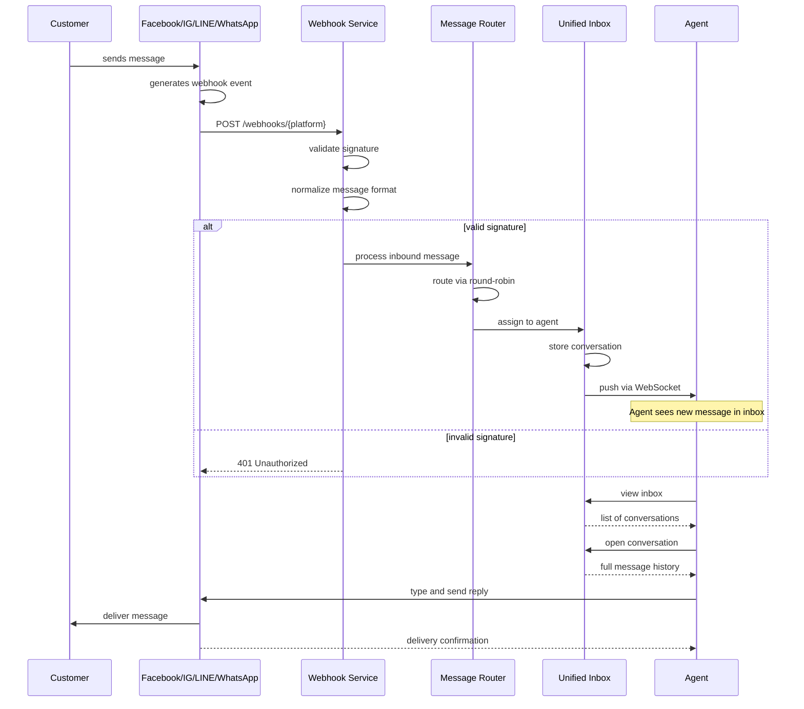
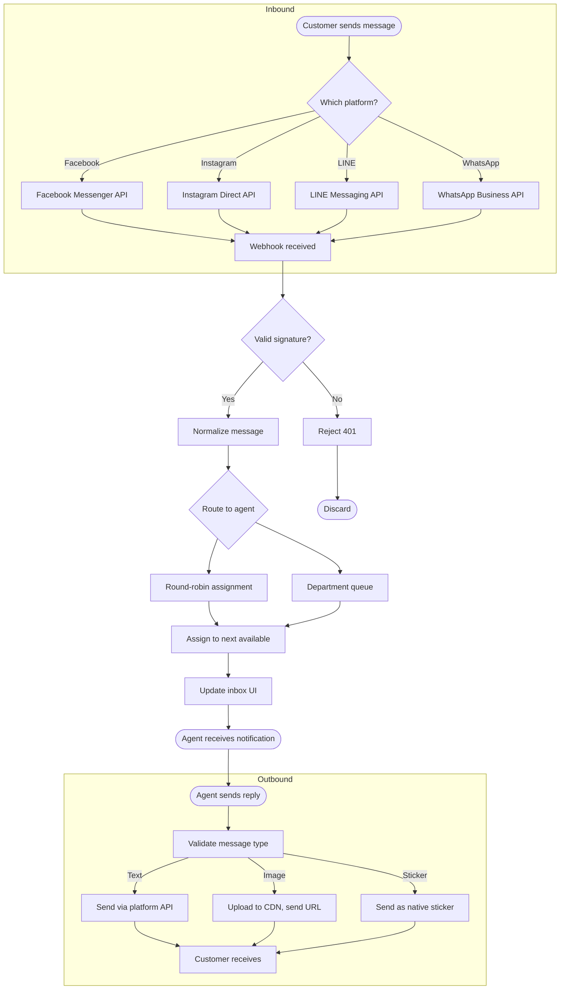

# Requirements — Omnichannel Social Chat

## 1. Overview

An omnichannel social chat system that aggregates messages from Facebook Messenger, Instagram Direct, LINE, and WhatsApp into a unified inbox. The system enables social media management teams (20+ agents organized by departments) to view, respond to, and manage customer conversations from all four platforms through a single interface. Real-time message delivery via webhooks supports >100,000 monthly messages with round-robin load balancing.

## 2. Actors

| Actor | Description |
|-------|-------------|
| **Agent** | Social media team member who reads and responds to customer messages |
| **Team Lead** | Department supervisor who assigns conversations and monitors team performance |
| **Admin** | System administrator who manages channels, agents, and system settings |
| **Customer** | External end-user who sends messages via Facebook, Instagram, LINE, or WhatsApp |
| **Webhook Provider** | External platform (Facebook, Instagram, LINE, WhatsApp) that pushes inbound messages |

## 3. User Story Map

### Activity: Manage social media conversations from a unified inbox

---

#### Step 1 — Admin connects a chat platform channel · Actor: Admin → Platform API

**US-OC-001**: As an admin, I want to connect a chat platform (Facebook, Instagram, LINE, or WhatsApp) by providing API credentials and configuring the webhook endpoint, so that the system can receive messages from that platform.

**Acceptance Criteria:**
- AC-1: Given I am an admin, when I add a new platform channel with valid credentials and webhook URL, then the connection is established and a test message is sent.
- AC-2: Given the webhook URL is unreachable, when I try to save the channel configuration, then an error is displayed and the channel is not saved.
- AC-3: Given a platform connection exists, when I edit the credentials, then the system re-validates the connection.

**Business Conditions:**
- BC-1: Supported platforms: Facebook Messenger, Instagram Direct, LINE Official Account, WhatsApp Business API.
- BC-2: Each platform requires valid API credentials (App ID/Secret, Access Token, or Business Account ID depending on platform).
- BC-3: Webhook URL must be HTTPS and reachable from external networks.

**Priority:** Must Have

---

#### Step 2 — Platform sends inbound message via webhook · Actor: Webhook Provider → System

**US-OC-002**: As the system, I want to receive inbound messages from connected platforms via webhooks, so that customers can reach the unified inbox without delay.

**Acceptance Criteria:**
- AC-1: Given a webhook request arrives with valid payload, when I parse the message, then a conversation is created or updated in the database within 500ms.
- AC-2: Given the webhook signature is invalid, when I receive the request, then the message is rejected with HTTP 401.
- AC-3: Given the platform is temporarily unavailable, when a webhook is received, then I return HTTP 200 immediately and process asynchronously.

**Business Conditions:**
- BC-1: Each platform uses different payload formats; the system must normalize all to a common internal schema.
- BC-2: Webhook requests must be validated using platform-specific signature verification (e.g., Meta's X-Hub-Signature-256, LINE's channel secret).
- BC-3: Inbound messages include: sender ID, channel, timestamp, content type (text/image/sticker), and content.

**Priority:** Must Have

---

#### Step 3 — System routes conversation to department via round-robin · Actor: System

**US-OC-003**: As the system, I want to route new conversations to available agents using round-robin distribution, so that workload is balanced across the team.

**Acceptance Criteria:**
- AC-1: Given a new conversation arrives, when no agent is currently assigned, then the system assigns it to the next available agent in the rotation.
- AC-2: Given all agents in the department are at capacity, when a new conversation arrives, then it is placed in a queue with FIFO ordering.
- AC-3: Given an agent becomes available, when the queue is not empty, then the oldest queued conversation is assigned to that agent.

**Business Conditions:**
- BC-1: Round-robin rotation is maintained per department.
- BC-2: Each agent has a configurable concurrent conversation limit (default: 10).
- BC-3: Agents marked as "offline" or "away" are excluded from round-robin distribution.

**Priority:** Must Have

---

#### Step 4 — Agent views unified inbox · Actor: Agent

**US-OC-004**: As an agent, I want to see all my assigned conversations in a unified inbox, so that I can respond to customers without switching between platforms.

**Acceptance Criteria:**
- AC-1: Given I am logged in, when I open the inbox, then I see all my assigned conversations sorted by newest activity.
- AC-2: Given a conversation has a new message, when I open it, then I see the full message history with the customer's channel indicator.
- AC-3: Given I have no assigned conversations, when I open the inbox, then I see an empty state with a waiting message.

**Business Conditions:**
- BC-1: Each conversation card shows: customer name/ID, channel icon, preview of last message, timestamp, and unread indicator.
- BC-2: Conversations are filterable by channel (Facebook, Instagram, LINE, WhatsApp).
- BC-3: The inbox refreshes automatically when new messages arrive (real-time via WebSocket).

**Priority:** Must Have

---

#### Step 5 — Agent sends text response · Actor: Agent → Customer

**US-OC-005**: As an agent, I want to type and send a text message to a customer, so that I can communicate through the customer's preferred platform.

**Acceptance Criteria:**
- AC-1: Given I am viewing a conversation, when I type a message and click Send, then the message is delivered to the customer via the platform's API within 3 seconds.
- AC-2: Given the platform API is slow, when I send a message, then I see a loading indicator until delivery is confirmed.
- AC-3: Given the platform API returns an error, when I send a message, then I see an error toast and the message is saved as a draft for retry.

**Business Conditions:**
- BC-1: Message must be sent via the platform's official API (not simulated).
- BC-2: Text messages support Unicode including emoji and special characters.
- BC-3: Maximum text length follows platform limits (WhatsApp: 4096 chars, others: 2000 chars).

**Priority:** Must Have

---

#### Step 6 — Agent sends image or media · Actor: Agent → Customer

**US-OC-006**: As an agent, I want to send images or stickers to a customer, so that I can share rich content beyond text.

**Acceptance Criteria:**
- AC-1: Given I am viewing a conversation, when I attach an image and click Send, then the image is uploaded to the platform and delivered to the customer.
- AC-2: Given I am viewing a conversation, when I send a sticker, then the sticker is sent as a platform-native sticker message.
- AC-3: Given the file exceeds the platform size limit, when I try to send it, then I see an error indicating the file is too large.

**Business Conditions:**
- BC-1: Supported media types: JPEG, PNG, GIF, WebP (images); platform-native stickers.
- BC-2: File size limits vary by platform (WhatsApp: 16MB, Facebook/Instagram: 8MB, LINE: 10MB).
- BC-3: Images are uploaded to the platform's CDN; the system stores only the media URL.

**Priority:** Should Have

---

#### Step 7 — Agent resolves conversation · Actor: Agent

**US-OC-007**: As an agent, I want to mark a conversation as resolved, so that it is archived and the customer is notified the conversation is closed.

**Acceptance Criteria:**
- AC-1: Given I am viewing a conversation, when I click "Resolve", then the conversation is archived and the customer receives a closure message.
- AC-2: Given a conversation is resolved, when the customer replies, then a new conversation is created and linked to the original.
- AC-3: Given I am a team lead, when I view resolved conversations, then I see all resolved conversations for my department.

**Business Conditions:**
- BC-1: Resolved conversations are moved to an archive and are searchable for 90 days.
- BC-2: Only the assigned agent or team lead can resolve a conversation.
- BC-3: A configurable auto-close rule can resolve conversations after X hours of inactivity.

**Priority:** Should Have

---

#### Step 8 — Team lead assigns conversation manually · Actor: Team Lead

**US-OC-008**: As a team lead, I want to manually reassign a conversation to a different agent, so that I can handle workload imbalances or specialized requests.

**Acceptance Criteria:**
- AC-1: Given I am viewing a conversation, when I click "Assign" and select an agent, then the conversation is reassigned and the new agent is notified.
- AC-2: Given the selected agent is at capacity, when I try to assign, then I see a warning and can override.
- AC-3: Given a conversation is reassigned, when the new agent opens their inbox, then they see the conversation with a "transferred" badge.

**Business Conditions:**
- BC-1: Only team leads and admins can reassign conversations.
- BC-2: A transfer history is recorded for audit purposes.
- BC-3: Notification is sent to the new agent via in-app notification.

**Priority:** Should Have

---

#### Step 9 — Agent updates availability status · Actor: Agent

**US-OC-009**: As an agent, I want to set my availability status (online, away, offline), so that the system knows when to route conversations to me.

**Acceptance Criteria:**
- AC-1: Given I am logged in, when I change my status to "offline", then I am excluded from round-robin routing immediately.
- AC-2: Given I am offline, when I log back in and set status to "online", then I am included in routing again.
- AC-3: Given my status is "away", when I am mentioned in a conversation, then I receive an in-app notification.

**Business Conditions:**
- BC-1: Status options: Online (receives new conversations), Away (receives mentions only), Offline (receives nothing).
- BC-2: Status changes take effect within 5 seconds across all system components.
- BC-3: Inactivity for 30 minutes auto-sets status to "away".

**Priority:** Should Have

---

#### Step 10 — Admin manages agents and departments · Actor: Admin

**US-OC-010**: As an admin, I want to create agents, organize them into departments, and manage their permissions, so that the organization structure reflects the team.

**Acceptance Criteria:**
- AC-1: Given I am an admin, when I create a new agent with email and password, then an invitation email is sent to the agent.
- AC-2: Given I am an admin, when I create a department and assign agents to it, then conversations can be routed to that department.
- AC-3: Given an agent leaves, when I deactivate their account, then they cannot log in and their conversations are reassigned.

**Business Conditions:**
- BC-1: Agents authenticate via email/password (built-in auth system).
- BC-2: Roles: Agent (default), Team Lead (can reassign, view department stats), Admin (full access).
- BC-3: Each agent belongs to exactly one department.

**Priority:** Must Have

## 4. Business Flow — Swimlane





## 5. Input / Output Field Specification

### 5.1 Webhook Inbound Payload (per platform)

#### Facebook / Instagram

| Field | Type | Required | Description |
|-------|------|----------|-------------|
| `entry[].messaging[].sender.id` | `string` | Yes | Sender's Page-scoped ID |
| `entry[].messaging[].recipient.id` | `string` | Yes | Recipient's Page ID |
| `entry[].messaging[].message.text` | `string` | No | Text content (if text) |
| `entry[].messaging[].message.attachments` | `array` | No | Media attachments |
| `entry[].messaging[].timestamp` | `integer` | Yes | Unix timestamp in ms |

#### LINE

| Field | Type | Required | Description |
|-------|------|----------|-------------|
| `events[].replyToken` | `string` | Yes | Reply token for responses |
| `events[].source.userId` | `string` | Yes | User's LINE ID |
| `events[].message.type` | `string` | Yes | text/image/sticker |
| `events[].message.text` | `string` | No | Text content |
| `events[].timestamp` | `integer` | Yes | Unix timestamp in seconds |

#### WhatsApp

| Field | Type | Required | Description |
|-------|------|----------|-------------|
| `entry[].changes[].value.messages[].from` | `string` | Yes | Customer phone number |
| `entry[].changes[].value.messages[].text.body` | `string` | No | Text content |
| `entry[].changes[].value.messages[].type` | `string` | Yes | text/image/document |
| `entry[].changes[].value.metadata.phone_number_id` | `string` | Yes | WhatsApp Business ID |

### 5.2 Internal Normalized Message Schema

| Field | Type | Required | Description |
|-------|------|----------|-------------|
| `messageId` | `string` | Yes | System-generated UUID |
| `conversationId` | `string` | Yes | UUID linking to conversation |
| `channel` | `enum` | Yes | facebook, instagram, line, whatsapp |
| `channelMessageId` | `string` | Yes | Original ID from platform |
| `direction` | `enum` | Yes | inbound, outbound |
| `senderId` | `string` | Yes | Platform-specific sender ID |
| `contentType` | `enum` | Yes | text, image, sticker, file |
| `content` | `string` | No | Text content or media URL |
| `metadata` | `object` | No | Platform-specific data |
| `timestamp` | `string` | Yes | ISO 8601 UTC |

### 5.3 Conversation Object

| Field | Type | Required | Description |
|-------|------|----------|-------------|
| `conversationId` | `string` | Yes | UUID v4 |
| `channel` | `enum` | Yes | facebook, instagram, line, whatsapp |
| `customerId` | `string` | Yes | Platform-specific customer ID |
| `customerName` | `string` | No | Display name from platform |
| `departmentId` | `string` | Yes | Assigned department |
| `assignedAgentId` | `string` | No | Currently assigned agent |
| `status` | `enum` | Yes | open, queued, resolved |
| `createdAt` | `string` | Yes | ISO 8601 UTC |
| `updatedAt` | `string` | Yes | ISO 8601 UTC |
| `resolvedAt` | `string` | No | ISO 8601 UTC |

### 5.4 Error Response Format

```json
{
  "code": "CHANNEL_ERROR",
  "message": "Failed to send message via platform.",
  "details": {
    "platform": "whatsapp",
    "errorCode": "RESOURCE_NOT_FOUND",
    "retryable": true
  }
}
```

### 5.5 Error Code Registry

| HTTP Status | Code | When |
|-------------|------|------|
| 400 | `VALIDATION_ERROR` | Invalid input fields |
| 400 | `MESSAGE_TOO_LONG` | Text exceeds platform limit |
| 400 | `UNSUPPORTED_MEDIA_TYPE` | File type not supported |
| 400 | `FILE_TOO_LARGE` | File exceeds size limit |
| 401 | `INVALID_SIGNATURE` | Webhook signature verification failed |
| 401 | `INVALID_CREDENTIALS` | Platform API credentials invalid |
| 403 | `CHANNEL_NOT_CONNECTED` | Platform channel not configured |
| 404 | `CONVERSATION_NOT_FOUND` | Conversation ID does not exist |
| 409 | `CONVERSATION_ALREADY_ASSIGNED` | Conversation assigned to another agent |
| 429 | `RATE_LIMIT_EXCEEDED` | Platform API rate limit reached |
| 500 | `PLATFORM_API_ERROR` | External platform returned error |
| 500 | `INTERNAL_ERROR` | Unexpected server error |

## 6. Functional Requirements

### Platform Integration

- **FR-OC-001**: The system shall accept webhook requests from Facebook, Instagram, LINE, and WhatsApp platforms and validate each request using platform-specific signature verification.
- **FR-OC-002**: The system shall normalize inbound messages from all platforms into a common internal schema containing messageId, channel, direction, senderId, contentType, content, and timestamp.
- **FR-OC-003**: The system shall send outbound messages via each platform's official API, supporting text, image, and sticker message types.
- **FR-OC-004**: The system shall store platform-specific credentials securely (encrypted at rest) and support credential rotation without service interruption.

### Unified Inbox

- **FR-OC-005**: The system shall display all assigned conversations in a unified inbox, sortable by newest activity, with channel indicator and message preview on each card.
- **FR-OC-006**: The system shall filter conversations by channel (Facebook, Instagram, LINE, WhatsApp) and by status (open, queued, resolved).
- **FR-OC-007**: The system shall deliver new messages to the inbox in real-time using WebSocket push notifications.
- **FR-OC-008**: The system shall support pagination for conversations with more than 50 items per page.

### Conversation Management

- **FR-OC-009**: The system shall create a new conversation when a customer sends a message and no active conversation exists for that customer on that channel.
- **FR-OC-010**: The system shall route new conversations to available agents using round-robin distribution within the assigned department.
- **FR-OC-011**: The system shall queue conversations when all agents in the department are at capacity and assign them in FIFO order when agents become available.
- **FR-OC-012**: The system shall allow team leads and admins to manually reassign conversations to different agents.
- **FR-OC-013**: The system shall mark conversations as resolved and optionally send a closure notification to the customer.
- **FR-OC-014**: The system shall reopen a resolved conversation as a new conversation when the customer replies.

### Agent Management

- **FR-OC-015**: The system shall authenticate agents using email and password with secure password hashing (bcrypt, cost factor >= 12).
- **FR-OC-016**: The system shall organize agents into departments, with each agent belonging to exactly one department.
- **FR-OC-017**: The system shall support three roles: Agent (default), Team Lead (department-level access), and Admin (system-wide access).
- **FR-OC-018**: The system shall track agent availability status (online, away, offline) and exclude offline agents from routing.
- **FR-OC-019**: The system shall auto-set agent status to "away" after 30 minutes of inactivity.

### Media Handling

- **FR-OC-020**: The system shall accept image uploads in JPEG, PNG, GIF, and WebP formats.
- **FR-OC-021**: The system shall enforce file size limits per platform (WhatsApp: 16MB, Facebook/Instagram: 8MB, LINE: 10MB) and return appropriate error for oversized files.
- **FR-OC-022**: The system shall upload media to platform CDNs and store only the returned media URL.

## 7. Non-Functional Requirements

### Performance

- **NFR-PERF-001**: The system shall receive and process webhook payloads within 500ms at the 95th percentile.
- **NFR-PERF-002**: The system shall send outbound messages within 3 seconds at the 95th percentile under normal conditions.
- **NFR-PERF-003**: The inbox UI shall display new messages within 2 seconds of webhook receipt via WebSocket.
- **NFR-PERF-004**: The system shall support >100,000 messages per month with linear scaling.

### Security

- **NFR-SEC-001**: All webhook endpoints shall validate platform-specific signatures before processing requests.
- **NFR-SEC-002**: Platform API credentials shall be encrypted at rest using AES-256.
- **NFR-SEC-003**: Agent passwords shall be hashed using bcrypt with cost factor >= 12.
- **NFR-SEC-004**: All API endpoints shall enforce authentication; unauthenticated requests shall return HTTP 401.
- **NFR-SEC-005**: Role-based access control shall restrict actions based on agent role (Agent, Team Lead, Admin).

### Reliability

- **NFR-REL-001**: If a platform API is temporarily unavailable, outbound messages shall be queued and retried with exponential backoff (up to 3 retries).
- **NFR-REL-002**: The system shall return HTTP 200 to webhooks immediately and process asynchronously to prevent webhook timeouts.
- **NFR-REL-003**: The system shall have an availability target of 99.9% per month.

### Scalability

- **NFR-SCALE-001**: The system architecture shall support horizontal scaling of webhook processors and inbox services.
- **NFR-SCALE-002**: Database connections shall be pooled with a maximum of 100 concurrent connections per instance.

### Auditability

- **NFR-AUD-001**: All message send/receive events shall be logged with timestamp, sender, recipient, channel, and outcome.
- **NFR-AUD-002**: Conversation transfer events shall be logged with the previous agent, new agent, timestamp, and initiating user.
- **NFR-AUD-003**: Logs shall not contain plaintext passwords or platform access tokens.

### Maintainability

- **NFR-MAINT-001**: Platform-specific webhook handlers shall be isolated modules that can be updated independently.
- **NFR-MAINT-002**: Channel credentials shall be configurable via environment variables or secrets manager without code deployment.

## 8. Open Questions

| # | Question | Owner | Due | Status |
|---|----------|-------|-----|--------|
| 1 | Do you need conversation tags/labels for categorization? | PM | TBD | Open |
| 2 | Should customers be able to initiate conversations or only respond? | PM | TBD | Open |
| 3 | What is the auto-close inactivity threshold (default suggested: 24 hours)? | PM | TBD | Open |
| 4 | Do you need a mobile app for agents or is web-only acceptable for MVP? | PM | TBD | Open |
| 5 | Should the system support typing indicators (customer is typing)? | PM | TBD | Open |

## 9. Out of Scope

- CRM integration (Salesforce, HubSpot, etc.)
- Knowledge base / FAQ suggestions
- Advanced analytics and reporting dashboards
- Conversation tagging and custom categories
- Customer satisfaction (CSAT) surveys
- Multi-language translation
- Voice messages / video calls
- Bot/AI auto-responses
- End-to-end encryption of message content
- Custom customer profiles across channels
- Self-service customer portal

## 10. Traceability

```
US-OC-001 (Connect channel)     → FR-OC-001, FR-OC-002, FR-OC-004
US-OC-002 (Receive webhook)     → FR-OC-001, FR-OC-002, NFR-SEC-001
US-OC-003 (Round-robin routing) → FR-OC-009, FR-OC-010, FR-OC-011
US-OC-004 (View inbox)          → FR-OC-005, FR-OC-006, FR-OC-007, FR-OC-008
US-OC-005 (Send text)           → FR-OC-003, NFR-PERF-002
US-OC-006 (Send media)          → FR-OC-003, FR-OC-020, FR-OC-021, FR-OC-022
US-OC-007 (Resolve conversation) → FR-OC-013, FR-OC-014
US-OC-008 (Reassign conversation) → FR-OC-012, NFR-AUD-002
US-OC-009 (Agent status)        → FR-OC-018, FR-OC-019
US-OC-010 (Manage agents)       → FR-OC-015, FR-OC-016, FR-OC-017, NFR-SEC-003, NFR-SEC-005
```
