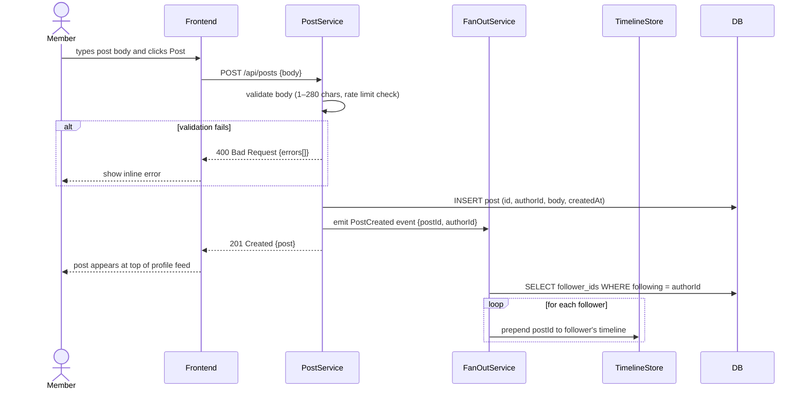
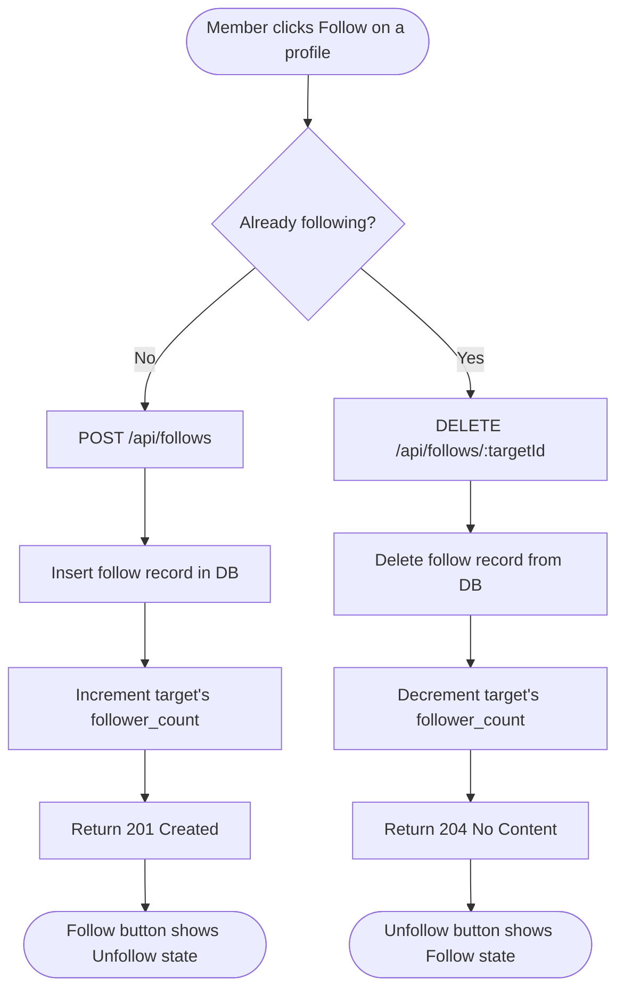
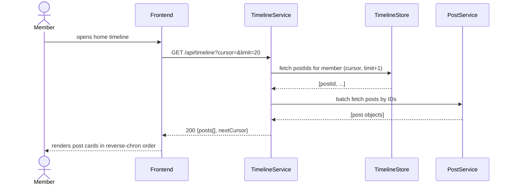

# Requirements — MicroBlog Platform (X.com-style)

## 1. Overview

MicroBlog is a social media platform where users post short text updates, follow other users, and browse a personalised timeline of posts. It mirrors the core experience of X.com — fast, public-first publishing with social engagement (likes, follows, replies). The platform targets anyone who wants to share thoughts publicly and engage with others in real time.

---

## 2. Actors

| Actor         | Description                                                         |
|---------------|---------------------------------------------------------------------|
| **Visitor**   | Unauthenticated user who can browse public profiles and posts       |
| **Member**    | Authenticated user who can post, like, follow, and view their feed  |
| **System**    | Backend services that process requests, store data, and fan out events |

---

## 3. User Story Map

### Activity 1 — Create an Account and Sign In

#### Step 1 — Visitor fills in the registration form · Actor: Visitor

**US-MB-001:** As a visitor, I want to register with a username, email, and password, so that I can become a member of the platform.

Acceptance Criteria:
- AC-1: Given I enter a valid username, email, and password, when I click Sign Up, then my account is created and I am redirected to my home timeline.
- AC-2: Given I enter an already-registered email, when I click Sign Up, then I see an error: "This email is already registered."
- AC-3: Given I enter a username already taken, when I click Sign Up, then I see an error: "Username is not available."
- AC-4: Given I enter an invalid email format, when I click Sign Up, then I see inline validation before submitting.

Business Conditions:
- BC-1: Username must be 3–30 characters, lowercase alphanumeric and underscores only.
- BC-2: Password must be ≥8 characters with ≥1 uppercase, ≥1 digit, ≥1 special character.
- BC-3: Email must be a valid format.

Priority: Must Have

---

#### Step 2 — Member signs in to an existing account · Actor: Member

**US-MB-002:** As a registered member, I want to sign in with my email and password, so that I can access my personalised timeline and post content.

Acceptance Criteria:
- AC-1: Given valid credentials, when I click Sign In, then I am authenticated and redirected to my home timeline.
- AC-2: Given incorrect credentials, when I click Sign In, then I see "Invalid email or password" without revealing which field is wrong.
- AC-3: Given 5 consecutive failed attempts, when I try again, then my account is temporarily locked for 15 minutes.

Business Conditions:
- BC-1: Failed attempts must be tracked per account, not per IP, to prevent account enumeration across IPs.
- BC-2: Sessions expire after 30 days of inactivity.

Priority: Must Have

---

#### Step 3 — Member signs out · Actor: Member

**US-MB-003:** As a member, I want to sign out, so that my session is terminated and the account is secure on shared devices.

Acceptance Criteria:
- AC-1: Given I am signed in, when I click Sign Out, then my session token is invalidated and I am redirected to the public landing page.

Priority: Must Have

---

### Activity 2 — Manage Profile

#### Step 4 — Member views their own profile · Actor: Member

**US-MB-004:** As a member, I want to view my public profile page, so that I can see how other users see me.

Acceptance Criteria:
- AC-1: Given I navigate to my profile, then I see my avatar, display name, username, bio, follower count, following count, and my posts in reverse chronological order.

Priority: Must Have

---

#### Step 5 — Member edits their profile · Actor: Member

**US-MB-005:** As a member, I want to update my display name, bio, and avatar, so that my profile reflects who I am.

Acceptance Criteria:
- AC-1: Given I update my display name and save, then changes are reflected immediately on my profile and on existing posts.
- AC-2: Given I upload a new avatar image, then it is resized and served from CDN within 5 seconds.
- AC-3: Given I enter a bio exceeding 160 characters, then I see a character-limit error before submission.

Business Conditions:
- BC-1: Display name: 1–50 characters.
- BC-2: Bio: max 160 characters.
- BC-3: Avatar: JPG or PNG, max 5 MB; resized to 400×400 px by the system.
- BC-4: Username cannot be changed after registration (MVP).

Priority: Must Have

---

### Activity 3 — Create and Manage Posts

#### Step 6 — Member creates a post · Actor: Member

**US-MB-006:** As a member, I want to write and publish a short text post, so that I can share my thoughts with followers and the public.

Acceptance Criteria:
- AC-1: Given I enter text within the 280-character limit and click Post, then the post appears at the top of my profile and my followers' timelines.
- AC-2: Given I exceed 280 characters, then the Post button is disabled and a character counter shows the overage in red.
- AC-3: Given I submit an empty post, then the Post button remains disabled.
- AC-4: Given the post is successfully created, then it is assigned a unique ID and a creation timestamp.

Business Conditions:
- BC-1: Post body: 1–280 characters, no leading/trailing whitespace.
- BC-2: A member may post a maximum of 100 posts per hour (rate limit).
- BC-3: Posts are public by default and visible to any visitor.

Priority: Must Have

---

#### Step 7 — Member deletes their own post · Actor: Member

**US-MB-007:** As a member, I want to delete one of my own posts, so that I can remove content I no longer want published.

Acceptance Criteria:
- AC-1: Given I click Delete on my own post and confirm, then the post is removed from my profile, all timelines, and all feeds immediately.
- AC-2: Given I attempt to delete another user's post, then the request is rejected with a 403 Forbidden.

Business Conditions:
- BC-1: Deletion is permanent and irreversible (no soft-delete in MVP).

Priority: Must Have

---

#### Step 8 — Member replies to a post · Actor: Member

**US-MB-008:** As a member, I want to reply to a post, so that I can join conversations publicly.

Acceptance Criteria:
- AC-1: Given I click Reply on a post and submit text, then my reply appears threaded under the original post.
- AC-2: Given a visitor views a post, then they can see replies without being signed in.

Business Conditions:
- BC-1: Reply body: 1–280 characters.
- BC-2: A reply is itself a post linked to a parent post ID.

Priority: Should Have

---

### Activity 4 — Social Engagement

#### Step 9 — Member likes a post · Actor: Member

**US-MB-009:** As a member, I want to like a post, so that I can express appreciation without replying.

Acceptance Criteria:
- AC-1: Given I click the Like button on a post, then the like count increments by 1 and the button shows the liked state.
- AC-2: Given I click Like again on an already-liked post, then the like is removed (toggle behaviour) and the count decrements.
- AC-3: Given I have already liked a post, then the Like button shows in an active/filled state when I view it again.

Business Conditions:
- BC-1: A member may like each post at most once.
- BC-2: A visitor cannot like posts.

Priority: Must Have

---

#### Step 10 — Member follows another user · Actor: Member

**US-MB-010:** As a member, I want to follow another user, so that their posts appear in my home timeline.

Acceptance Criteria:
- AC-1: Given I click Follow on another user's profile, then a follow relationship is created and their future posts appear in my timeline.
- AC-2: Given I click Unfollow on a user I follow, then the relationship is removed and their posts no longer appear in my timeline.
- AC-3: Given I view my own profile, then I cannot see a Follow button for myself.

Business Conditions:
- BC-1: A member cannot follow themselves.
- BC-2: A follow is a one-way relationship (no mutual-follow requirement in MVP).

Priority: Must Have

---

#### Step 11 — Member views a user's profile and follower lists · Actor: Member / Visitor

**US-MB-011:** As a visitor or member, I want to view a user's follower and following lists, so that I can discover related accounts.

Acceptance Criteria:
- AC-1: Given I navigate to a user's Followers tab, then I see a paginated list of users who follow them.
- AC-2: Given I navigate to a user's Following tab, then I see a paginated list of users they follow.

Priority: Should Have

---

### Activity 5 — Browse and Discover Content

#### Step 12 — Member views their home timeline · Actor: Member

**US-MB-012:** As a member, I want to see a chronological feed of posts from users I follow, so that I can stay up to date without searching.

Acceptance Criteria:
- AC-1: Given I open the home timeline, then I see posts from followed users in reverse-chronological order, newest first.
- AC-2: Given I follow no one, then I see a prompt encouraging me to follow accounts.
- AC-3: Given new posts arrive while I am viewing the timeline, then a "Show N new posts" banner appears at the top; clicking it loads the new posts.

Business Conditions:
- BC-1: Timeline shows posts from the last 7 days only (MVP); older posts are accessible via the poster's profile.
- BC-2: Timeline is paginated in batches of 20 posts.

Priority: Must Have

---

#### Step 13 — Visitor or member browses the public explore feed · Actor: Visitor / Member

**US-MB-013:** As a visitor or member, I want to browse a public feed of recent posts from all members, so that I can discover new content and users.

Acceptance Criteria:
- AC-1: Given I open the Explore page, then I see a reverse-chronological list of public posts from all members.
- AC-2: Given I enter a keyword in the search bar, then I see posts containing that keyword and user accounts whose username/display-name matches.

Business Conditions:
- BC-1: Explore feed is paginated in batches of 20.
- BC-2: Search results are not ranked by relevance in MVP — newest match first.

Priority: Must Have (feed) / Should Have (search)

---

#### Step 14 — Visitor or member views a single post and its thread · Actor: Visitor / Member

**US-MB-014:** As a visitor or member, I want to click on a post to view its full thread, so that I can read the context and all replies.

Acceptance Criteria:
- AC-1: Given I click on a post, then I see the full post body, like count, reply count, poster's avatar and display name, and all replies threaded below.

Priority: Must Have

---

### Activity 6 — Notifications

#### Step 15 — Member receives in-app notifications · Actor: System → Member

**US-MB-015:** As a member, I want to receive notifications when someone likes, replies to, or follows me, so that I am aware of engagement on my content.

Acceptance Criteria:
- AC-1: Given someone likes my post, then a notification appears in my notifications list.
- AC-2: Given someone replies to my post, then a notification links me to the reply.
- AC-3: Given someone follows me, then a notification shows their username.
- AC-4: Given I open the Notifications page, then I see notifications in reverse-chronological order, with unread ones highlighted.

Business Conditions:
- BC-1: Notifications are in-app only in MVP (no email/push notifications).
- BC-2: Notifications are retained for 30 days.

Priority: Should Have

---

## 4. Business Flow — Swimlane

### Post Creation and Timeline Fan-Out



### Follow / Unfollow



### Home Timeline Load



---

## 5. Input / Output Field Specification

### 5.1 Register

**Input**

| Field      | Type     | Required | Constraints                                                          | Example          |
|------------|----------|----------|----------------------------------------------------------------------|------------------|
| `username` | `string` | Yes      | 3–30 chars, lowercase alphanumeric + underscore                      | `alice_dev`      |
| `email`    | `string` | Yes      | Valid email format                                                   | `alice@mail.com` |
| `password` | `string` | Yes      | 8–64 chars, ≥1 uppercase, ≥1 digit, ≥1 special char                 | `P@ssw0rd!`      |

**Output (201 Created)**

| Field         | Type     | Always | Notes                  |
|---------------|----------|--------|------------------------|
| `userId`      | `string` | Yes    | UUID v4                |
| `username`    | `string` | Yes    |                        |
| `email`       | `string` | Yes    | Lowercase              |
| `createdAt`   | `string` | Yes    | ISO 8601 UTC           |
| `accessToken` | `string` | Yes    | JWT, 1 hour TTL        |
| `refreshToken`| `string` | Yes    | Opaque token, 30 days  |

---

### 5.2 Create Post

**Input**

| Field  | Type     | Required | Constraints           | Example              |
|--------|----------|----------|-----------------------|----------------------|
| `body` | `string` | Yes      | 1–280 chars, non-empty | `Hello, MicroBlog!` |

**Output (201 Created)**

| Field       | Type     | Always | Notes              |
|-------------|----------|--------|--------------------|
| `postId`    | `string` | Yes    | UUID v4            |
| `body`      | `string` | Yes    |                    |
| `authorId`  | `string` | Yes    |                    |
| `likeCount` | `number` | Yes    | Starts at 0        |
| `replyCount`| `number` | Yes    | Starts at 0        |
| `createdAt` | `string` | Yes    | ISO 8601 UTC       |

---

### 5.3 Follow / Unfollow

**Follow Input — POST /api/follows**

| Field      | Type     | Required | Notes          |
|------------|----------|----------|----------------|
| `targetId` | `string` | Yes      | UUID of target |

**Unfollow Input — DELETE /api/follows/:targetId** — no body, targetId in path.

**Output** — 201 (follow created), 204 (unfollowed), no body.

---

### 5.4 Like / Unlike

**Like Input — POST /api/posts/:postId/likes** — no body, postId in path.
**Unlike Input — DELETE /api/posts/:postId/likes** — no body.

**Output** — 201 (liked) or 204 (unliked), no body.

---

### 5.5 Timeline Query

**Input — GET /api/timeline**

| Param    | Type     | Required | Constraints             | Default |
|----------|----------|----------|-------------------------|---------|
| `cursor` | `string` | No       | Opaque pagination cursor | start  |
| `limit`  | `number` | No       | 1–50                    | 20      |

**Output (200 OK)**

| Field        | Type            | Notes                                       |
|--------------|-----------------|---------------------------------------------|
| `posts`      | `Post[]`        | Array of post objects (see 5.2 output)      |
| `nextCursor` | `string | null` | Null when no more pages                     |

---

### Error Code Registry

| HTTP | Code                    | When                                              |
|------|-------------------------|---------------------------------------------------|
| 400  | `VALIDATION_ERROR`      | One or more input fields fail validation          |
| 400  | `POST_TOO_LONG`         | Post body exceeds 280 characters                  |
| 400  | `POST_EMPTY`            | Post body is empty or whitespace only             |
| 401  | `UNAUTHENTICATED`       | Request requires authentication                   |
| 403  | `FORBIDDEN`             | Authenticated but not authorised for this action  |
| 404  | `NOT_FOUND`             | Resource does not exist                           |
| 409  | `EMAIL_ALREADY_EXISTS`  | Email already registered                          |
| 409  | `USERNAME_TAKEN`        | Username already taken                            |
| 409  | `ALREADY_FOLLOWING`     | Follow relationship already exists                |
| 409  | `ALREADY_LIKED`         | Like already exists for this post                 |
| 429  | `RATE_LIMIT_EXCEEDED`   | Too many requests in a time window                |
| 500  | `INTERNAL_ERROR`        | Unexpected server error                           |

---

## 6. Functional Requirements

### Authentication

```
FR-MB-001: The system shall create a user account and return an access token and refresh token
           when registration inputs pass all validation rules.

FR-MB-002: The system shall reject registration with HTTP 409 EMAIL_ALREADY_EXISTS
           when the submitted email is already registered.

FR-MB-003: The system shall reject registration with HTTP 409 USERNAME_TAKEN
           when the submitted username is already taken.

FR-MB-004: The system shall authenticate a member and return a new access token
           when valid email and password are provided.

FR-MB-005: The system shall reject a sign-in attempt with HTTP 401 and a generic error message
           without revealing which field is incorrect.

FR-MB-006: The system shall lock a member's account for 15 minutes after 5 consecutive
           failed sign-in attempts.

FR-MB-007: The system shall invalidate the session token immediately upon sign-out.

FR-MB-008: The system shall store passwords as bcrypt hashes and must never store
           or return plaintext passwords.
```

### Profile

```
FR-MB-009: The system shall serve a member's public profile including display name, username,
           bio, avatar URL, follower count, following count, and posts.

FR-MB-010: The system shall update a member's profile fields (display name, bio, avatar)
           and reflect changes immediately across all views.

FR-MB-011: The system shall reject a bio update that exceeds 160 characters with HTTP 400.

FR-MB-012: The system shall resize uploaded avatar images to 400×400 px and serve them
           from a CDN URL.
```

### Posts

```
FR-MB-013: The system shall create a post and associate it with the authenticated member
           when the body is between 1 and 280 characters.

FR-MB-014: The system shall reject a post creation request with HTTP 400 POST_TOO_LONG
           when the body exceeds 280 characters.

FR-MB-015: The system shall reject a post creation request with HTTP 400 POST_EMPTY
           when the body is empty or contains only whitespace.

FR-MB-016: The system shall delete a post and remove it from all feeds and timelines
           when the authenticated member is the post author.

FR-MB-017: The system shall reject a delete request with HTTP 403 FORBIDDEN
           when the authenticated member is not the post author.

FR-MB-018: The system shall fan out a new post to the home timelines of all followers
           of the author within 5 seconds of creation.
```

### Likes

```
FR-MB-019: The system shall record a like for a post and increment its like count
           when an authenticated member likes a post they have not previously liked.

FR-MB-020: The system shall remove a like from a post and decrement its like count
           when an authenticated member unlikes a post they have previously liked.

FR-MB-021: The system shall reject a duplicate like with HTTP 409 ALREADY_LIKED.
```

### Follows

```
FR-MB-022: The system shall create a follow relationship from the authenticated member
           to the target user when no such relationship already exists and the target
           is not the authenticated member themselves.

FR-MB-023: The system shall remove the follow relationship when the authenticated member
           unfollows a user they currently follow.

FR-MB-024: The system shall reject a self-follow request with HTTP 403 FORBIDDEN.

FR-MB-025: The system shall reject a duplicate follow with HTTP 409 ALREADY_FOLLOWING.
```

### Timeline & Discovery

```
FR-MB-026: The system shall return a paginated, reverse-chronological list of posts
           from users the authenticated member follows when the home timeline is requested.

FR-MB-027: The system shall return a paginated, reverse-chronological list of all public posts
           when the explore feed is requested by any visitor or member.

FR-MB-028: The system shall return posts and user accounts matching a keyword query
           when a search is performed.

FR-MB-029: The system shall return a post and all its direct replies when a single
           post detail view is requested.
```

### Notifications

```
FR-MB-030: The system shall create an in-app notification for the post author
           when another member likes their post.

FR-MB-031: The system shall create an in-app notification for the post author
           when another member replies to their post.

FR-MB-032: The system shall create an in-app notification for the target member
           when another member follows them.

FR-MB-033: The system shall return a paginated list of the authenticated member's notifications
           in reverse-chronological order, marking unread items distinctly.
```

---

## 7. Non-Functional Requirements

### Performance

```
NFR-PERF-001: All API endpoints shall respond within 300ms at the 95th percentile
              under a steady-state load of 200 concurrent users.

NFR-PERF-002: The home timeline shall be served from a pre-computed read store (cache)
              and shall not perform a real-time JOIN across the follows and posts tables
              on every request.

NFR-PERF-003: Post fan-out to follower timelines shall complete within 5 seconds
              for authors with up to 10,000 followers.

NFR-PERF-004: Avatar images shall be served from a CDN with a cache TTL of at least 7 days.
```

### Security

```
NFR-SEC-001: Passwords shall be hashed using bcrypt with a minimum cost factor of 12.

NFR-SEC-002: Access tokens shall be JWTs signed with HS256 and shall expire after 1 hour.

NFR-SEC-003: Refresh tokens shall be cryptographically random (≥32 bytes) and stored
             as a hash in the database.

NFR-SEC-004: All API traffic shall be served over HTTPS only; HTTP requests shall
             be redirected with 301.

NFR-SEC-005: The API shall enforce CORS to allow requests only from the registered
             frontend origin.

NFR-SEC-006: The registration and sign-in endpoints shall be rate-limited to
             10 requests per IP per minute.

NFR-SEC-007: Post creation shall be rate-limited to 100 posts per member per hour.
```

### Reliability

```
NFR-REL-001: The platform shall target 99.9% monthly availability for all core endpoints
             (auth, timeline, post, follow, like).

NFR-REL-002: The fan-out service shall use an async queue; a queue consumer failure
             shall not affect the post creation response.
```

### Scalability

```
NFR-SCALE-001: The timeline store shall support pre-computed feeds for members with
               up to 10,000 followers without degradation (fan-out-on-write model).

NFR-SCALE-002: The database schema shall support horizontal read scaling via
               read replicas for timeline and explore queries.
```

### Compliance & Privacy

```
NFR-COMP-001: The system shall log every authentication attempt (success/failure) with
              timestamp, IP address, and outcome — never logging passwords or tokens.

NFR-COMP-002: Deleted posts shall be purged from all stores and timelines immediately
              and must not be recoverable via any API endpoint.

NFR-COMP-003: User personal data (email, IP) shall not be included in any public
              API response.
```

### Maintainability

```
NFR-MAINT-001: Rate limit thresholds (posts/hour, sign-in attempts, token TTL)
               shall be configurable via environment variables without redeployment.

NFR-MAINT-002: The fan-out worker shall be independently deployable and scalable
               without affecting the post API service.
```

---

## 8. Open Questions

| # | Question | Owner | Status |
|---|----------|-------|--------|
| 1 | Should the explore feed support trending/algorithmic ranking in a future iteration? | Product | Open |
| 2 | Is email verification required before a new member can post? | Product | Open |
| 3 | Should follows be public (visible to other users) or private? | Product | Open |
| 4 | Are image attachments in posts required for MVP? | Product | Open |
| 5 | Should repost/quote-post be included in MVP? | Product | Open |

---

## 9. Out of Scope (MVP)

- Email or push notifications
- Hashtags and trending topics
- Image/video attachments in posts
- Direct messages
- Lists or groups
- Repost / Quote-post
- Account verification badges
- Block / Mute users
- Username change after registration
- Algorithmic feed ranking

---

## 10. Traceability

```
US-MB-001  →  FR-MB-001, FR-MB-002, FR-MB-003, FR-MB-008
US-MB-002  →  FR-MB-004, FR-MB-005, FR-MB-006
US-MB-003  →  FR-MB-007
US-MB-004  →  FR-MB-009
US-MB-005  →  FR-MB-010, FR-MB-011, FR-MB-012
US-MB-006  →  FR-MB-013, FR-MB-014, FR-MB-015, FR-MB-018
US-MB-007  →  FR-MB-016, FR-MB-017
US-MB-008  →  FR-MB-013, FR-MB-014 (parentPostId variant)
US-MB-009  →  FR-MB-019, FR-MB-020, FR-MB-021
US-MB-010  →  FR-MB-022, FR-MB-023, FR-MB-024, FR-MB-025
US-MB-011  →  FR-MB-009
US-MB-012  →  FR-MB-026
US-MB-013  →  FR-MB-027, FR-MB-028
US-MB-014  →  FR-MB-029
US-MB-015  →  FR-MB-030, FR-MB-031, FR-MB-032, FR-MB-033
```
