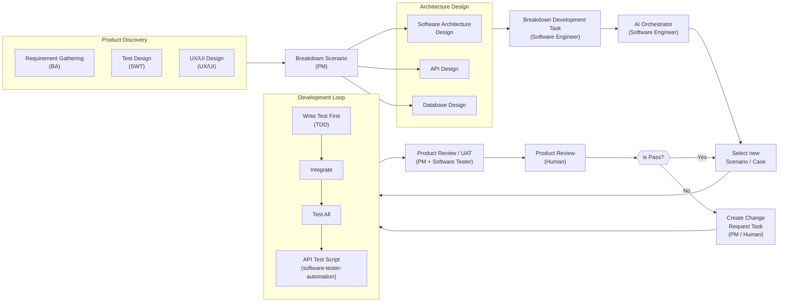

# Development Workflow

```mermaid
flowchart LR
    subgraph PD["Product Discovery"]
        BA["Requirement Gathering\n(BA)"]
        SWT["Test Design\n(SWT)"]
        UX["UX/UI Design\n(UX/UI)"]
    end

    subgraph ARCH["Architecture Design"]
        SAD["Software Architecture\nDesign"]
        API["API Design"]
        DB["Database Design"]
    end

    subgraph DEVLOOP["Development Loop"]
        TDD["Write Test First\n(TDD)"]
        INT["Integrate"]
        TESTALL["Test All"]
        SCRIPT["API Test Script\n(software-tester-automation)"]
    end

    PM["Breakdown Scenario\n(PM)"]
    DEV["Breakdown Development Task\n(Software Engineer)"]
    ORC["AI Orchestrator\n(Software Engineer)"]
    SEL["Select new\nScenario / Case"]
    UAT["Product Review / UAT\n(PM + Software Tester)"]
    HUMAN["Product Review\n(Human)"]
    PASS{{"is Pass?"}}
    CR["Create Change\nRequest Task\n(PM / Human)"]

    PD --> PM
    PM --> SAD
    PM --> API
    PM --> DB
    ARCH --> DEV
    DEV --> ORC
    ORC --> SEL
    SEL --> DEVLOOP
    TDD --> INT --> TESTALL --> SCRIPT
    DEVLOOP --> UAT
    UAT --> HUMAN
    HUMAN --> PASS
    PASS -- Yes --> SEL
    PASS -- No --> CR
    CR --> DEVLOOP
```
