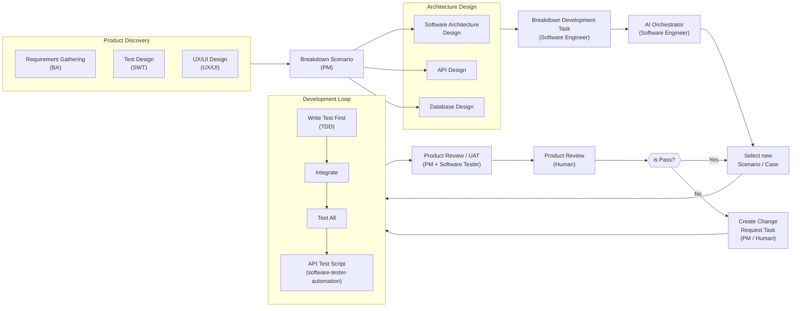
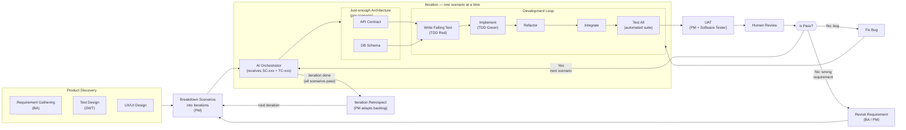

# AI Agent Software Development Workflow

Concepts: **Shift-Left Testing · Agile / Iterative & Incremental · TDD · User Story Mapping (JTBD) · AI Orchestration · Human-in-the-Loop**

---

## Original Flow

---

## Suggested Improvements

### 1. Architecture Design should be iterative, not upfront

The original flow does all architecture before any development — this is waterfall-shaped. Architecture should be scoped **per scenario** (just enough for the current task), living inside the iteration loop alongside the AI Orchestrator.

### 2. AI Orchestrator needs an explicit responsibility boundary

The Orchestrator is the most novel node but currently a black box. It should be defined as:

| Does | Does NOT |
|---|---|
| Read TC-xxx → understand Definition of Done | Pick the next scenario (PM's job) |
| Write failing test first (TDD red) | Make scope changes (BA/PM's job) |
| Implement minimum code (TDD green) | Approve its own work (Human's job) |
| Refactor, integrate, run full test suite | |
| Commit and signal ready for review | |

### 3. Change Request needs two paths, not one

Not all failures are the same:
- **Bug** → fix in the Development Loop
- **Wrong requirement / misunderstood scenario** → must go back to BA/PM, not just the dev loop

### 4. Missing: Iteration Retrospect

"Yes → Select next Scenario" loops forever with no higher-level checkpoint. After a batch of scenarios (one iteration) is done, PM should review the increment, update priorities, and adapt the backlog before the next iteration begins.

### 5. UX/UI has no lane in the Development Loop

UX/UI disappears after Product Discovery. The AI Orchestrator should know whether the current scenario is backend-only, frontend-only, or full-stack and run the appropriate loop.

### 6. Missing skills to build

| Diagram node | Current skill | Gap |
|---|---|---|
| Requirement Gathering | `business-analysis` | ✓ |
| Test Design | `software-tester-design` | ✓ |
| Breakdown Scenario + Iteration | `project-management` | ✓ |
| API Test Script | `software-tester-automation` | ✓ |
| Software **Architecture** / API / DB Design | — | **missing** |
| AI Orchestrator | — | **missing** |

---

## Improved Flow

---

## Key Principles

| Principle | How it appears in this flow |
|---|---|
| **Shift-Left Testing** | SWT designs TC-xxx in Product Discovery before any code exists. TC-xxx = Definition of Done for the AI Orchestrator. |
| **User Story Mapping (JTBD)** | BA maps scenarios following the job flow (not UI screens). Each scenario = one job step. PM slices them into iterations. |
| **Agile Iterative & Incremental** | One scenario at a time through the loop. Each pass produces a working, tested increment. Retrospect adapts the backlog. |
| **TDD** | AI Orchestrator writes the failing test first, then implements just enough to make it pass. |
| **Just-enough Architecture** | API contract and DB schema are produced per scenario, not upfront for the whole system. |
| **Human-in-the-Loop** | Human review is a hard gate before marking a scenario done. Humans also handle wrong-requirement failures. |
| **AI Orchestration** | AI drives the Development Loop autonomously within the boundaries of one scenario + its test cases. |
